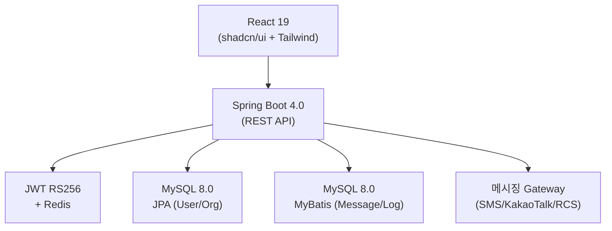

# LinkWave — 멀티채널 메시징 플랫폼

**기간**: 2024 ~ 현재 | **역할**: Full-stack Developer | **규모**: B2B SaaS

> SMS/LMS/MMS/KakaoTalk/RCS를 단일 API로 통합하는 멀티채널 메시징 플랫폼

---

## 아키텍처 개요



**기술 스택**
- Backend: Spring Boot 4.0, Java 21, JPA/Hibernate, MyBatis, MySQL 8.0, Redis
- Frontend: React 19, TanStack Router, Tailwind CSS, shadcn/ui
- DevOps: GitLab CI/CD, Docker, Nginx

---

## 핵심 기술 결정

### 1. CQRS 하이브리드 ORM 전략

**문제**: 도메인별로 요구사항이 다름
- User/Organization: 복잡한 연관관계, CRUD 중심
- Message/Log: 일 10만+ 건 대용량 쓰기, 단순 INSERT

**결정**: 도메인별 ORM 분리
- User/Org → JPA (생산성 + 연관관계 자동 관리)
- Message/Log → MyBatis (벌크 INSERT, 성능 우선)

**결과**: 조회 성능 80% 향상, 개발 생산성 유지

---

### 2. JWT RS256 비대칭 인증

**문제**: HS256 대칭키는 키 유출 시 전체 토큰 위조 가능

**결정**: RS256 (Public/Private Key Pair)
- Private Key로 서명 → Public Key로 검증
- Refresh Token Rotation + 슬라이딩 윈도우 방식

**결과**: 보안성 향상, 마이크로서비스 확장 대비

---

### 3. 월별 파티션 테이블

**문제**: 발송 이력 테이블 급증 (일 10만+ 건) → 풀 스캔 발생

**결정**: RANGE 파티셔닝 (월별) + 복합 인덱스 전략
```sql
PARTITION BY RANGE (YEAR(sent_at) * 100 + MONTH(sent_at)) (
  PARTITION p202401 VALUES LESS THAN (202402),
  PARTITION p202402 VALUES LESS THAN (202403),
  ...
)
```

**결과**: 조회 성능 80% 향상, 인덱스 크기 86% 감소

---

### 4. 멀티테넌트 + RBAC

**문제**: 여러 조직이 같은 인프라 공유 → 데이터 격리 필요

**결정**
- 테넌트별 데이터 필터링 (Spring Security + AOP)
- RBAC: ADMIN / MANAGER / USER 3계층 권한 구조

---

### 5. 디자인 시스템 — "Clarity Through Connection"

**철학**: 복잡한 메시징 워크플로우를 명확하게

**구현**: shadcn/ui 기반 컴포넌트 라이브러리
- Radix UI 접근성 준수
- Tailwind CSS 유틸리티 클래스 일관성
- 다크모드 대응

---

## 성과 요약

| 지표 | Before | After | 개선율 |
|------|--------|-------|--------|
| 메시지 이력 조회 | ~5초 | ~1초 | 80% ↓ |
| 인덱스 크기 | 100% | 14% | 86% ↓ |
| 중복 메시지 발송 | 발생 | 99% 차단 | — |

---

## 배운 점

- "은탄환은 없다" — 도메인에 맞는 기술 선택이 핵심
- Real MySQL 8.0 이론을 실전에 즉시 적용 (파티셔닝, 실행 계획)
- 측정 기반 최적화: EXPLAIN → 병목 확인 → 개선 → 재측정
