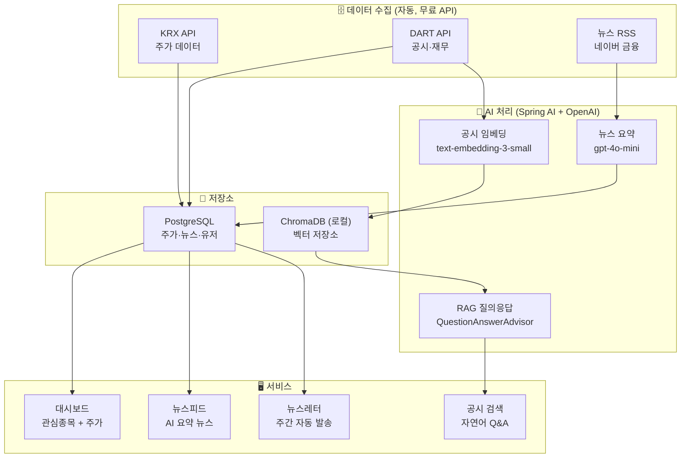
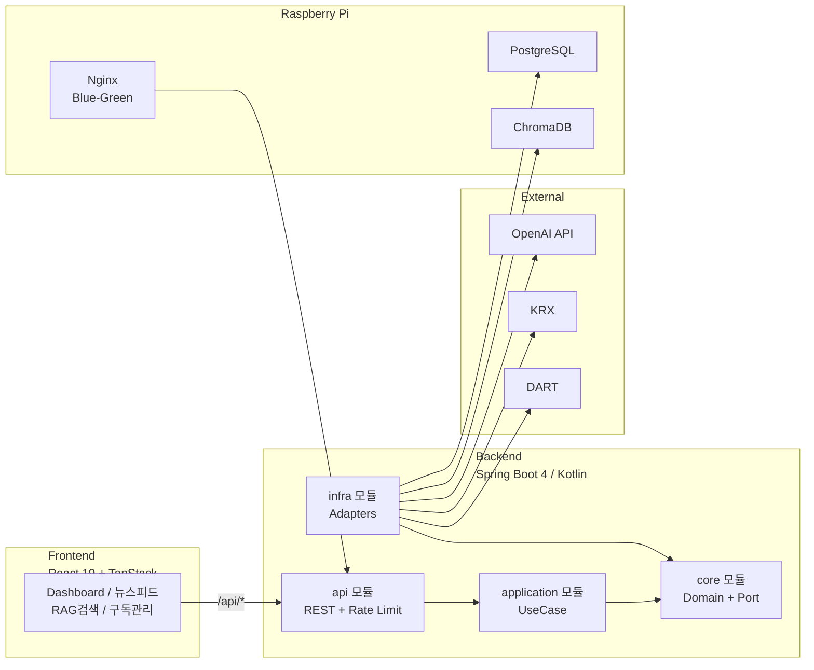
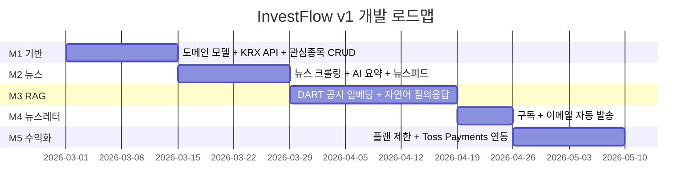

# InvestFlow v1 — AI 금융 인텔리전스 플랫폼

> "공시·뉴스를 직접 읽는 수고 없이, AI가 요약·분석·질의응답을 대신한다"

---

## 제품 개요

세 가지 기능을 하나의 플랫폼으로 통합한다.

| 기능 | 설명 |
|------|------|
| 📰 AI 뉴스 다이제스트 | 금융 뉴스 자동 수집 → AI 요약 → 뉴스레터 발송 |
| 📈 주식 분석 (investFlow) | KRX 주가 + DART 재무 데이터 + AI 인사이트 |
| 🔍 RAG 공시 검색 | DART 공시 임베딩 → 자연어 질의응답 |

**수익 모델:** FREE / PRO(월 9,900원) 구독 플랜

---

## 전체 흐름



---

## 시스템 구성도



---

## 개발 단계



---

## RAG 선택: Spring AI로 직접 구축

```
❌ Flowise / LangChain → Python 서버 추가, 기술스택 분리
✅ Spring AI           → Spring 생태계 내 완결, 추상화 제공

Spring AI가 제공:
  DocumentReader  → 공시 문서 파싱
  TextSplitter    → 청킹
  EmbeddingModel  → text-embedding-3-small
  VectorStore     → ChromaDB 연결
  QuestionAnswerAdvisor → RAG 파이프라인
```

---

## 비용

| 항목 | 월 비용 |
|------|---------|
| Raspberry Pi 전기 | ~3,000원 |
| OpenAI API 전체 | ~5,000~15,000원 |
| **합계** | **~10,000~20,000원** |

손익분기점: **PRO 구독자 2명**

---

## 저장소

- Backend: `.links/invest-flow/invest-flow-backend/`
- Frontend: `.links/invest-flow/invest-flow-frontend/`
- 운영: `mystudy.iptime.org` (Raspberry Pi, Blue-Green)
