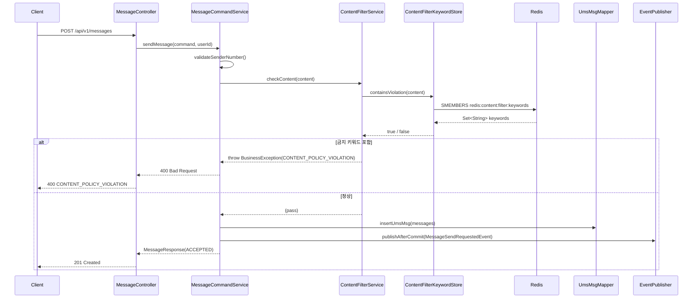
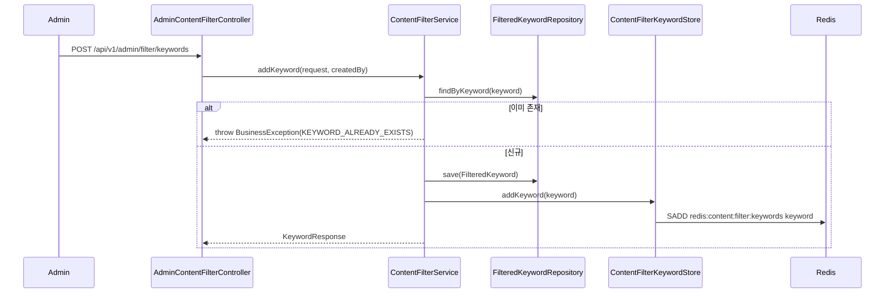

# Content Filter — Implementation Guide

## Overview

`ContentFilter` 모듈은 메시지 발송 요청이 SNAP 큐에 인입되기 전에 금지 키워드를 포함한 콘텐츠를 차단하는 플랫폼 이용약관 집행 레이어다. `MessageCommandService.sendMessage()` 내 `validateSenderNumber()` 직후에 삽입되어, 불법 스팸·금융 사기 등 이용 약관 위반 메시지가 발송 시스템에 진입하지 못하도록 막는다. Admin API를 통해 SUPER_ADMIN이 금지 키워드를 실시간으로 추가·삭제할 수 있으며, 변경 사항은 즉시 Redis에 반영된다.

---

## Why This Exists

**왜 LinkWave가 직접 콘텐츠 필터링을 하는가?**

SNAP(통신사 중계)은 통신망 레벨의 스팸 탐지를 한다. 그것은 발송이 이미 시도된 이후의 필터다. LinkWave는 플랫폼 이용약관의 집행자이며, 약관 위반 발송을 시도 자체부터 막아야 한다. 이메일 SaaS에서 금지어 필터링이 MTA(메일 전송 에이전트)가 아닌 애플리케이션 레이어에 있는 것과 같은 이유다.

**왜 Redis Set인가?**

메시지 발송은 수신자 수만큼 반복된다. 수신자가 100명이면 DB 조회도 100번이다. Redis Set은 모든 키워드를 메모리에 올려두고 `SMEMBERS`로 한 번에 가져온 뒤 로컬에서 비교한다. 읽기 비용이 O(1) 수준으로 유지되고, 키워드 CRUD 시에는 `SADD`/`SREM` 한 번으로 즉시 동기화된다. TTL을 설정하지 않는 이유는 키워드가 수동 관리 대상이기 때문이다 — 자동 만료가 아니라 명시적 삭제로만 제거되어야 한다.

**왜 400이고 이력(`message_history`)을 저장하지 않는가?**

`MessageCommandService`는 발송이 결정된 후 `UmsMsg`를 `ums_msg` 테이블에 INSERT하고 `MessageSendRequestedEvent`를 발행한다. `message_history`는 이 이벤트를 소비해 만들어지는 조회용 Read Model이다. 콘텐츠 필터에서 400을 던지면 `validateSenderNumber()` 직후이므로 아직 어떤 INSERT도 발생하지 않았다. "발송 시도 자체가 없었던" 요청의 이력을 남기는 것은 도메인 계약 위반이다. BLOCKED 상태를 `message_history`에 넣고 싶은 충동이 들 수 있지만, 그것은 발송 플로우의 관심사가 아니다.

**대안으로 고려할 수 있는 것들과 왜 선택하지 않았는가?**

| 대안 | 왜 선택하지 않았는가 |
|------|----------------------|
| 매 요청마다 DB(MySQL) 조회 | 수신자 N명 = N번 쿼리. 발송 핫패스에 I/O 지연 삽입 |
| Spring Cache (`@Cacheable`) | 캐시 키 설계와 eviction 타이밍이 복잡해진다. Redis Set 직접 사용이 더 단순하고 명확하다 |
| 별도 필터링 마이크로서비스 | 현 아키텍처 규모에서 오버엔지니어링. 네트워크 홉 추가로 핫패스 지연 증가 |

---

## Architecture Flow



**Admin 키워드 관리 흐름:**



---

## Layer Breakdown

### domain/filter/FilteredKeyword.java

**소유:** 금지 키워드의 영속 상태 표현. 누가 언제 등록했는지 추적.

**소유하지 말아야 할 것:** Redis 의존성, 서비스 로직, 검증 로직.

```java
@Entity
@Table(name = "filtered_keywords")
public class FilteredKeyword {
    @Id @GeneratedValue(strategy = GenerationType.IDENTITY)
    private Long id;

    @Column(unique = true, length = 100, nullable = false)
    private String keyword;

    @Column(length = 50)
    private String createdBy;

    private LocalDateTime createdAt;
}
```

**왜 이 경계가 여기 있는가:** 도메인 엔티티는 저장소 기술(JPA, Redis)을 모른다. `FilteredKeyword`는 "무엇이 등록되어 있는가"의 진실 원본(source of truth)이고, Redis는 그것의 빠른 조회 캐시다. 이 둘은 역할이 다르다.

---

### infra/jpa/repository/FilteredKeywordRepository.java

**소유:** JPA를 통한 `FilteredKeyword` CRUD. `findByKeyword`로 중복 방지.

**소유하지 말아야 할 것:** Redis 동기화 로직, 비즈니스 검증.

```java
public interface FilteredKeywordRepository extends JpaRepository<FilteredKeyword, Long> {
    Optional<FilteredKeyword> findByKeyword(String keyword);
}
```

**왜 이 경계가 여기 있는가:** JPA Repository는 기술 어댑터다. `ContentFilterService`는 이 인터페이스만 알고, MySQL이든 PostgreSQL이든 구현 교체 시 서비스 코드는 변하지 않는다.

---

### infra/redis/ContentFilterKeywordStore.java

**소유:** Redis Set `redis:content:filter:keywords` 의 읽기/쓰기. 앱 시작 시 DB → Redis 동기화(`@PostConstruct`).

**소유하지 말아야 할 것:** DB 접근, 비즈니스 규칙, 예외 변환.

```java
@Slf4j
@Component
@RequiredArgsConstructor
public class ContentFilterKeywordStore {

    private final RedisTemplate<String, String> redisTemplate;
    private final FilteredKeywordRepository filteredKeywordRepository;

    private static final String FILTER_KEY = "redis:content:filter:keywords";

    @PostConstruct
    public void loadAllToCache() {
        List<String> keywords = filteredKeywordRepository.findAll()
            .stream().map(FilteredKeyword::getKeyword).toList();
        if (!keywords.isEmpty()) {
            redisTemplate.opsForSet().add(FILTER_KEY, keywords.toArray(String[]::new));
        }
        log.info("콘텐츠 필터 키워드 {}개를 Redis에 로드했습니다.", keywords.size());
    }

    public void addKeyword(String keyword) {
        redisTemplate.opsForSet().add(FILTER_KEY, keyword);
    }

    public void removeKeyword(String keyword) {
        redisTemplate.opsForSet().remove(FILTER_KEY, keyword);
    }

    public boolean containsViolation(String content) {
        Set<String> keywords = redisTemplate.opsForSet().members(FILTER_KEY);
        if (keywords == null || keywords.isEmpty()) return false;
        String lowerContent = content.toLowerCase();
        return keywords.stream().anyMatch(kw -> lowerContent.contains(kw.toLowerCase()));
    }
}
```

**왜 `AccessTokenBlacklistStore`와 구조가 다른가:** `AccessTokenBlacklistStore`는 `opsForValue`(String key-value + TTL)를 사용한다. 토큰 블랙리스트는 "이 특정 토큰이 있는가" — 키 자체가 데이터다. 콘텐츠 필터는 "이 Set에 어떤 멤버가 있는가" — `opsForSet`을 쓰는 것이 의미적으로 정확하다.

**왜 `@PostConstruct`인가:** 앱이 시작될 때 Redis가 비어있으면 모든 발송이 필터를 통과한다. 재시작 시 DB에 저장된 키워드를 Redis에 복원하는 것이 일관성 보장의 최소 요건이다. 단, Redis가 재시작 없이 플러시될 경우에 대비해 Admin API의 `addKeyword`/`removeKeyword`는 항상 DB와 Redis를 동시에 갱신한다.

---

### application/service/ContentFilterService.java

**소유:** 콘텐츠 정책 비즈니스 로직 — 검증, 키워드 CRUD 조율, 목록 조회.

**소유하지 말아야 할 것:** Redis 직접 접근(Store에 위임), HTTP 응답 구성.

```java
@Service
@RequiredArgsConstructor
@Transactional
public class ContentFilterService {

    private final FilteredKeywordRepository filteredKeywordRepository;
    private final ContentFilterKeywordStore keywordStore;

    public void checkContent(String content) {
        if (keywordStore.containsViolation(content)) {
            throw new BusinessException(ErrorCode.CONTENT_POLICY_VIOLATION);
        }
    }

    public KeywordResponse addKeyword(AddKeywordRequest request, String createdBy) {
        if (filteredKeywordRepository.findByKeyword(request.keyword()).isPresent()) {
            throw new BusinessException(ErrorCode.KEYWORD_ALREADY_EXISTS);
        }
        FilteredKeyword entity = FilteredKeyword.builder()
            .keyword(request.keyword())
            .createdBy(createdBy)
            .createdAt(LocalDateTime.now())
            .build();
        FilteredKeyword saved = filteredKeywordRepository.save(entity);
        keywordStore.addKeyword(saved.getKeyword());
        return KeywordResponse.from(saved);
    }

    public void removeKeyword(Long id) {
        FilteredKeyword keyword = filteredKeywordRepository.findById(id)
            .orElseThrow(() -> new BusinessException(ErrorCode.RESOURCE_NOT_FOUND));
        filteredKeywordRepository.delete(keyword);
        keywordStore.removeKeyword(keyword.getKeyword());
    }

    @Transactional(readOnly = true)
    public List<KeywordResponse> listKeywords() {
        return filteredKeywordRepository.findAll().stream()
            .map(KeywordResponse::from)
            .toList();
    }
}
```

**왜 서비스가 DB와 Redis를 모두 호출하는가:** DB는 영속성 보장, Redis는 성능 최적화다. 이 두 가지는 서로 다른 책임이므로 서비스 레이어에서 조율한다. Store에 DB 로직을 넣으면 인프라 클래스가 비즈니스 책임을 갖게 된다.

---

### api/AdminContentFilterController.java

**소유:** Admin 키워드 관리 HTTP 엔드포인트. SUPER_ADMIN 권한 보호.

**소유하지 말아야 할 것:** 비즈니스 로직, Redis/DB 직접 접근.

```java
@Slf4j
@RestController
@RequiredArgsConstructor
@RequestMapping("/api/v1/admin/filter/keywords")
public class AdminContentFilterController {

    private final ContentFilterService contentFilterService;

    @PostMapping
    public ResponseEntity<ApiResponse<KeywordResponse>> addKeyword(
        @Valid @RequestBody AddKeywordRequest request,
        @AuthenticationPrincipal CustomUserDetails userDetails) {
        KeywordResponse response = contentFilterService.addKeyword(request, userDetails.getUsername());
        return ResponseEntity.status(HttpStatus.CREATED).body(ApiResponse.success(response));
    }

    @DeleteMapping("/{id}")
    public ResponseEntity<ApiResponse<Void>> removeKeyword(@PathVariable Long id) {
        contentFilterService.removeKeyword(id);
        return ResponseEntity.ok(ApiResponse.success(null));
    }

    @GetMapping
    public ResponseEntity<ApiResponse<List<KeywordResponse>>> listKeywords() {
        return ResponseEntity.ok(ApiResponse.success(contentFilterService.listKeywords()));
    }
}
```

---

## Key Design Decisions

| 결정 | Why | Trade-off |
|------|-----|-----------|
| Redis Set, TTL 없음 | 키워드는 수동 관리 대상. 자동 만료 시 필터 우회 가능성 | 키워드 증가 시 메모리 관리를 수동으로 해야 함 |
| `@PostConstruct`로 DB → Redis 동기화 | Redis 재시작 후에도 필터링 일관성 유지 | 앱 시작 시간 미세 증가 (키워드 수백 개 수준이면 무시 가능) |
| `checkContent` 위치: `validateSenderNumber()` 직후 | 발신번호 유효성 확인 후 콘텐츠 검사. 두 검증 모두 SNAP 큐 인입 전 방어선 | 미래에 검증 순서 논쟁이 생길 수 있음. 현재는 "소유권 → 내용"이 논리적 순서 |
| BLOCKED 이력 미저장 | `message_history`는 발송이 시작된 것의 Read Model. 시도되지 않은 발송의 이력은 도메인 계약 위반 | 관리자가 차단 현황을 모니터링하려면 별도 감사 로그(audit log) 필요 |
| Admin 전용 API (`/api/v1/admin/**`) | 키워드 추가/삭제는 SUPER_ADMIN만 가능. 오남용 시 정상 메시지까지 차단됨 | 긴급 상황 대응을 위한 권한 위임 체계가 없음 (현재 스코프 외) |
| 대소문자 무시(`toLowerCase`) | "대출", "大出", "DAECHUL"을 다르게 처리하면 우회가 쉬워짐 | 한글은 대소문자 개념이 없으므로 영문 혼용 키워드에만 의미 있음 |

---

## Implementation Steps

### Step 1: ErrorCode 추가
- [ ] `common/exception/ErrorCode.java` 수정 — 메시지 섹션 마지막 `MESSAGE_ALREADY_SENT` 아래에 추가

```java
CONTENT_POLICY_VIOLATION(400, "M013", "Message content violates content policy"),
KEYWORD_ALREADY_EXISTS(409, "M014", "Keyword already registered"),
```

**왜 먼저:** 이후 모든 레이어가 이 코드를 참조한다. 컴파일 순서상 반드시 먼저 존재해야 한다.

**주의:** `M013`, `M014` 코드가 기존에 없는지 `ErrorCode.java` 전체를 확인하고 추가한다.

---

### Step 2: 도메인 엔티티 생성
- [ ] `domain/filter/FilteredKeyword.java` 신규 생성

**왜 두 번째:** 도메인 객체는 다른 어떤 레이어도 의존하지 않는다. 가장 안쪽 레이어부터 바깥쪽으로 만드는 것이 의존성 방향 원칙이다.

**주의:** `@Table(name = "filtered_keywords")`에 `uniqueConstraints`를 명시하거나 `@Column(unique = true)`를 keyword 필드에 설정해야 DB 스키마에 유니크 제약이 생긴다. 둘 다 빠트리면 애플리케이션 레벨 검증만 남는다.

---

### Step 3: JPA Repository 생성
- [ ] `infra/jpa/repository/FilteredKeywordRepository.java` 신규 생성

**왜 세 번째:** 도메인 엔티티가 존재해야 Repository가 제네릭 타입으로 참조할 수 있다.

**주의:** `JpaRepository<FilteredKeyword, Long>` 상속 — PK 타입을 `Long`으로 맞출 것. `findByKeyword(String)`을 직접 선언해야 중복 체크에 쓸 수 있다.

---

### Step 4: Redis Store 생성
- [ ] `infra/redis/ContentFilterKeywordStore.java` 신규 생성

**왜 네 번째:** `@PostConstruct`에서 `FilteredKeywordRepository`를 주입받아 DB → Redis 동기화를 한다. Repository가 먼저 있어야 한다.

**주의 1:** `redisTemplate.opsForSet().members(FILTER_KEY)`는 키가 존재하지 않으면 `null`을 반환한다. null 체크를 반드시 추가하라.

**주의 2:** `AccessTokenBlacklistStore`는 `opsForValue`를 사용한다. 여기는 `opsForSet`이다. 패턴을 참조할 때 ops 타입을 혼동하지 않도록 주의한다.

**주의 3:** `FILTER_KEY = "redis:content:filter:keywords"` — 네임스페이스 구분자로 `:`을 쓰는 것이 Redis 컨벤션이다. `AccessTokenBlacklistStore`의 `"blacklist:"` 패턴과 일관성을 유지한다.

---

### Step 5: DTO 생성
- [ ] `application/dto/request/filter/AddKeywordRequest.java` 신규 생성 (record: `keyword`)
- [ ] `application/dto/response/filter/KeywordResponse.java` 신규 생성 (record: `id`, `keyword`, `createdAt`)

**왜 다섯 번째:** Service가 이 DTO를 파라미터/반환 타입으로 사용한다. Service보다 먼저 있어야 한다.

**주의:** `AddKeywordRequest`의 `keyword` 필드에 `@NotBlank`와 `@Size(max = 100)` 검증을 추가하라. 빈 문자열이 등록되면 모든 메시지가 차단된다.

---

### Step 6: ContentFilterService 생성
- [ ] `application/service/ContentFilterService.java` 신규 생성

**왜 여섯 번째:** DTO, Repository, Store가 모두 준비된 후에야 서비스를 조립할 수 있다.

**주의:** `addKeyword`는 트랜잭션 내에서 DB 저장 후 `keywordStore.addKeyword()`를 호출한다. DB 저장이 롤백되면 Redis는 그대로 남는다. 현재 설계에서는 이것이 허용 가능한 trade-off다 — 롤백 시 Redis에 유령 키워드가 생기지만, `@PostConstruct`가 앱 재시작 시 DB 기준으로 재동기화한다. 즉각적인 일관성이 필요하다면 트랜잭션 커밋 후 Redis 동기화(TransactionSynchronizationManager)를 고려할 수 있다.

---

### Step 7: MessageCommandService 수정
- [ ] `application/service/MessageCommandService.java` 수정 — `validateSenderNumber()` 직후 L43 위치에 삽입

```java
// 기존 L43
validateSenderNumber(userId, command.senderNumber());
// 추가
contentFilterService.checkContent(command.content());
```

`MessageCommandService`에 `ContentFilterService` 의존성을 `@RequiredArgsConstructor` 패턴으로 추가한다.

**왜 일곱 번째:** 서비스가 존재해야 참조 가능하다. 또한 이 수정은 기존 동작을 변경하므로 최대한 늦게 건드리는 것이 좋다 — 새 코드를 먼저 안정화한 후 연결한다.

**주의:** `content()`가 null일 수 있는 케이스(LMS 발송 시 제목만 보내는 경우)를 확인하라. null content는 `containsViolation`에서 NPE를 발생시킨다. Store에서 null 가드를 추가하거나, Service에서 null 체크 후 pass한다.

---

### Step 8: AdminContentFilterController 생성
- [ ] `api/AdminContentFilterController.java` 신규 생성

**왜 여덟 번째:** Controller는 바깥쪽 어댑터다. 모든 내부 레이어가 완성된 후 연결한다.

**주의:** `@AuthenticationPrincipal CustomUserDetails`에서 `getUsername()`이 이메일을 반환하는지 확인하라. `createdBy` 필드에 저장할 식별자가 이메일인지 userId인지 팀 컨벤션을 따른다.

---

### Step 9: SecurityConfig 수정
- [ ] `config/SecurityConfig.java` 수정 — `/api/v1/admin/**` 경로에 `ROLE_SUPER_ADMIN` 권한 제한 추가

현재 `SecurityConfig`는 모든 인증된 요청을 허용한다(`.anyRequest().authenticated()`). Admin 경로를 구분하려면 `authorizeHttpRequests` 체인에 다음을 추가한다:

```java
.requestMatchers("/api/v1/admin/**").hasRole("SUPER_ADMIN")
```

**왜 아홉 번째:** Admin API가 존재하는 상태에서 Security 설정이 없으면 모든 인증 사용자가 키워드를 추가/삭제할 수 있다. Controller 생성과 Security 설정은 반드시 함께 배포되어야 한다.

**주의:** Spring Security의 `hasRole("SUPER_ADMIN")`은 내부적으로 `ROLE_SUPER_ADMIN` 권한을 확인한다. `UserRole.SUPER_ADMIN`이 `GrantedAuthority`로 올바르게 매핑되어 있는지 `CustomUserDetails`의 `getAuthorities()` 구현을 확인하라.

---

### Step 10: 단위 테스트 작성
- [ ] `application/service/ContentFilterServiceTest.java` 신규 생성 (Mock Redis)
- [ ] `infra/redis/ContentFilterKeywordStoreIT.java` 신규 생성 (TestContainers Redis)

**왜 마지막:** 구현이 완료된 후 실제 동작을 확인하고 회귀 방지용으로 추가한다. `RefreshTokenStoreTest`의 `@ExtendWith(MockitoExtension.class)` + `@Mock RedisTemplate` 패턴을 그대로 활용하면 된다.

---

## Code Skeleton Reference

**도메인 + 서비스 레이어 스켈레톤 생성:**

> "Use agent skeleton-backend to generate ContentFilter feature skeleton: FilteredKeyword entity (table=filtered_keywords, fields: id Long PK, keyword String UNIQUE length=100, createdBy String length=50, createdAt LocalDateTime), FilteredKeywordRepository (findByKeyword), ContentFilterKeywordStore (Redis Set, @PostConstruct loadAllToCache, addKeyword, removeKeyword, containsViolation), ContentFilterService (checkContent, addKeyword, removeKeyword, listKeywords), AdminContentFilterController (POST/DELETE/GET /api/v1/admin/filter/keywords)"

---

## Learning Insights

- **Redis 자료구조 선택의 의미:** `AccessTokenBlacklistStore`가 `opsForValue`를 쓰는 이유는 "이 토큰이 존재하는가"라는 단일 키 조회이기 때문이다. `ContentFilterKeywordStore`가 `opsForSet`을 쓰는 이유는 "이 집합의 멤버를 모두 가져와서 포함 여부를 확인"하는 집합 연산이기 때문이다. 같은 Redis지만 문제의 성격에 따라 자료구조가 달라진다. 이것이 Redis를 단순한 캐시가 아니라 데이터 구조 서버로 보는 시각이다.

- **핫패스 보호:** `MessageCommandService.sendMessage()`는 실제 트래픽이 집중되는 핫패스다. 이 경로에 DB I/O를 추가할 때는 항상 "N 수신자 = N 쿼리"가 되지 않는지 확인해야 한다. Redis SMEMBERS는 네트워크 I/O가 1번이고 나머지는 메모리 내 반복이다.

- **`@PostConstruct`의 역할:** 이것은 단순한 초기화 훅이 아니다. "Redis는 휘발성이다"라는 사실을 아는 코드가 DB와의 동기화를 스스로 책임지는 패턴이다. 인프라 불안정성을 애플리케이션 코드가 보상하는 설계 결정이다.

- **도메인 계약으로서의 이력 설계:** `message_history`가 "발송이 시작된 것"만 기록한다는 결정은 단순한 구현 선택이 아니다. 이 엔티티가 무엇을 대표하는지에 대한 도메인 계약이다. 인터뷰에서 "왜 BLOCKED 상태가 없나요?"라는 질문에 "발송 시도 이전에 차단되므로 발송 이벤트 자체가 발생하지 않았기 때문입니다"라고 답할 수 있어야 한다.

- **계층 간 동기화의 책임 소재:** DB와 Redis 동기화를 `ContentFilterService`(애플리케이션 레이어)가 담당하는 것은 의도적이다. `ContentFilterKeywordStore`(인프라 레이어)가 DB를 직접 알면 인프라가 인프라를 호출하는 구조가 된다. 서비스가 두 인프라를 조율하는 것이 의존성 방향상 올바르다.

---

## Pitfalls & Gotchas

**1. Redis `members()` null 반환을 처리하지 않으면 NPE 발생**

`redisTemplate.opsForSet().members(key)`는 해당 키가 존재하지 않으면 `null`을 반환한다 (`Collections.emptySet()`이 아니다). `containsViolation`에서 `keywords.stream()`을 곧바로 호출하면 앱 시작 직후(아직 `@PostConstruct`가 실행되지 않은 경우) NullPointerException이 발생한다. 반드시 null 체크 후 early return한다.

**2. DB 저장 롤백 후 Redis에 유령 키워드가 남는 경우**

`addKeyword`는 `@Transactional` 내에서 `filteredKeywordRepository.save()` → `keywordStore.addKeyword()` 순서로 실행된다. DB 저장이 성공하고 Redis 호출이 실패하거나 반대로 DB가 롤백되면 Redis에는 키워드가 남는다. 이 경우 존재하지 않아야 할 키워드가 메시지를 차단한다. 즉각적인 일관성이 필요하다면 `TransactionSynchronizationManager.registerSynchronization()`으로 트랜잭션 커밋 후 Redis 동기화를 수행한다. 현재 설계에서는 앱 재시작 시 `@PostConstruct`가 DB 기준으로 재동기화하므로 운영 임팩트는 제한적이다.

**3. SecurityConfig 변경 순서를 잘못 잡으면 Admin API가 일시적으로 모든 사용자에게 노출된다**

Controller를 먼저 배포하고 SecurityConfig 변경을 다음 배포로 미루면 그 사이에 키워드 관리 API가 인증만 되면 누구나 호출 가능한 상태가 된다. Admin Controller 생성과 Security 설정은 반드시 같은 배포 단위에 포함시킨다. 로컬 테스트에서도 `hasRole("SUPER_ADMIN")` 설정 전후 동작을 별도로 확인한다.

**4. `containsViolation`의 대소문자 처리가 한글 키워드에는 의미 없다**

`toLowerCase()`는 영문 혼용 키워드("loan", "LOAN")에는 효과적이다. 순수 한글 키워드("대출", "불법")에는 변환이 일어나지 않으므로 이 처리의 존재가 한글 우회를 막는다는 착각을 해서는 안 된다. 한글 변형(초성 조합, 유사 문자)을 막으려면 정규화 전처리나 음절 분해 등 별도 처리가 필요하다 — 현재 스코프에서는 정확히 일치하는 한글 키워드만 차단된다는 제약을 인지하고 있어야 한다.

---

## Vault Log Prompt

> "Log today's session: implemented content-filter module for Linkwave, learned Redis Set vs opsForValue selection by problem shape, @PostConstruct as infrastructure volatility compensation pattern, domain contract-based history design (BLOCKED state not stored because send event never fires), hot-path I/O minimization via Redis SMEMBERS, and Security-Controller same-deploy requirement. Key insight was that Redis data structure choice reflects the semantic of the operation — membership testing uses Set, not key-value."
