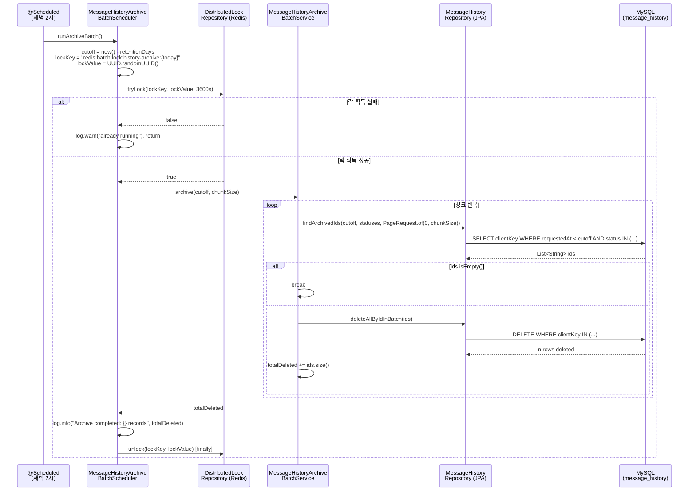

# message_history 아카이빙 배치 — Implementation Guide

## Overview

`message_history`는 LinkWave의 메시지 발송 이력을 저장하는 Read Model이다. 수신번호(`recipientPhone`), 메시지 내용(`content`), 발신번호(`senderNumber`) 등 개인정보를 포함하므로 개인정보보호법상 보존 기간이 지난 데이터는 파기 의무가 발생한다. 이 배치는 매일 새벽 2시에 실행되어 기준일(`now() - retentionDays`) 이전의 종료 상태(SUCCESS, FAILED, CANCELLED) 레코드를 1,000건 단위로 청크 삭제한다. Redis 분산 락을 통해 다중 인스턴스 환경에서도 같은 날짜에 대한 중복 실행을 방지한다.

---

## Why This Exists

### 왜 LinkWave가 아카이빙을 담당하는가?

`message_history`는 SNAP(외부 UMS)의 `ums_msg`와 별개로 LinkWave가 직접 생성하고 관리하는 Read Model이다. SNAP은 자신의 `ums_msg` 보존 주기를 별도로 관리한다. LinkWave는 `recipientPhone`·`content` 같은 민감 정보를 자체 DB에 보유하고 있기 때문에, 이 데이터의 파기 책임은 LinkWave에 있다. 외부 시스템에 이 책임을 위임할 수 없다.

### 왜 배치인가?

개인정보보호법의 파기 기준은 "목적 달성 후 지체 없이"이며 실시간 즉시성을 요구하지 않는다. DELETE 이벤트를 실시간 트리거로 연결하면 발송 API 요청마다 파기 조건 평가 로직이 따라붙어 SRP(단일 책임)를 무너뜨린다. 야간 배치로 분리하면 비즈니스 로직과 데이터 생명주기 관리가 명확히 분리된다.

### 왜 청크 삭제인가?

InnoDB는 DELETE 실행 중 대상 레코드에 레코드 락(record lock)을 건다. 수십만 건을 한 트랜잭션에서 삭제하면 락이 그 기간 동안 유지되어 동시에 실행 중인 조회/발송 API 쿼리가 대기 상태에 빠진다. 1,000건씩 나눠 커밋하면 각 청크 트랜잭션이 완료되는 순간 락이 해제되어 다른 쿼리가 진입할 수 있다. 현재 `SnapSimulatorProperties`의 `batch-size: 1000`과 동일한 단위를 사용해 설정 일관성을 유지한다.

### 왜 Redis 분산 락인가?

배포 환경에서 동일 서비스가 2개 이상 인스턴스로 실행될 수 있다. `@Scheduled`는 JVM 프로세스별로 독립 실행되므로 두 인스턴스가 같은 cutoff 날짜 범위를 동시에 처리하면 "이미 삭제된 ID"에 대한 DELETE가 재시도된다. 이 자체는 무해하지만(MySQL은 없는 레코드 DELETE를 조용히 무시) 로그에 잘못된 삭제 건수가 기록되어 감사(audit) 추적이 오염된다. 날짜별 락 키로 동일 날짜 실행을 한 인스턴스로 제한한다.

### 이 기능이 없다면?

보존 기간이 지난 개인정보가 DB에 무기한 축적된다. 개인정보보호법 위반, 스토리지 비용 증가, 데이터 유출 시 파급 범위 확대라는 세 가지 문제가 동시에 발생한다.

---

## Architecture Flow



---

## Layer Breakdown

### `infra/redis/DistributedLockRepository`

**소유**: Redis SET NX EX 원자적 획득과 Lua 스크립트 기반 안전 해제.

**해선 안 되는 것**: 비즈니스 규칙(cutoff 계산, 삭제 건수 집계)을 알아서는 안 된다. 이 클래스는 "락 키를 받아 획득/해제"만 수행한다.

**핵심 포인트**: `unlock()`에서 단순 `DEL`을 사용하면 안 된다. 락을 획득한 인스턴스가 아닌 다른 인스턴스의 락까지 지울 수 있기 때문이다. Lua 스크립트로 "내가 저장한 값(`lockValue`)과 현재 저장된 값이 같을 때만 DEL"을 원자적으로 수행해야 한다. 이 패턴은 `AccessTokenBlacklistStore`의 `redisTemplate.opsForValue().set()` 기반 위에 `setIfAbsent()`(SET NX)를 추가하는 방식으로 구현한다.

**경계가 존재하는 이유**: 분산 락은 인프라 관심사다. Service가 `RedisTemplate`을 직접 다루면 단위 테스트에서 Redis 없이 Service 로직을 검증할 수 없다.

---

### `application/service/MessageHistoryArchiveBatchService`

**소유**: 청크 반복 루프, 총 삭제 건수 집계, 트랜잭션 경계.

**해선 안 되는 것**: Redis 락 획득/해제, 스케줄 타이밍, `@Scheduled` 어노테이션. 이 계층은 "언제 실행할지"를 몰라야 한다.

**트랜잭션 경계 설계**: 메서드 전체가 아닌 청크 단위로 트랜잭션을 커밋해야 InnoDB 락이 청크 완료 후 해제된다. `deleteAllByIdInBatch()`는 내부적으로 JPA `EntityManager.flush()`와 `clear()`를 호출하므로 `@Transactional`을 청크 루프 안의 내부 메서드에 걸거나, `deleteAllByIdInBatch()`가 자체 트랜잭션을 갖는 구조로 설계한다. 전체 메서드에 `@Transactional`을 걸면 루프 종료까지 모든 락이 유지된다.

**경계가 존재하는 이유**: Service는 순수한 비즈니스 규칙(파기 대상 조건, 청크 반복 전략)을 담는다. 스케줄러와 분리함으로써 "배치를 수동으로 트리거"하거나 "테스트에서 직접 호출"하는 것이 가능해진다.

---

### `application/scheduler/MessageHistoryArchiveBatchScheduler`

**소유**: `@Scheduled` 크론 표현식, 락 획득/해제 조율, 프로퍼티에서 cutoff·chunkSize 읽기.

**해선 안 되는 것**: 직접 Repository를 호출하거나 삭제 로직을 작성하는 것. 스케줄러는 "오케스트레이터"다.

**`finally` 블록 필수**: Service 실행 중 예외가 발생해도 락이 반드시 해제되도록 `try-finally`로 감싸야 한다. 락 TTL(3600초)이 자동 만료 보험 역할을 하지만, 정상 완료 후에도 1시간 동안 락이 유지되는 것은 불필요하다.

---

### `infra/jpa/repository/MessageHistoryRepository` (수정)

**추가할 메서드**: `findArchivedIds(Instant cutoff, List<String> statuses, Pageable pageable)`

**왜 엔티티 전체가 아닌 ID만 조회하는가**: 청크 반복에서 `MessageHistory` 엔티티 전체를 로드하면 `content`(최대 2000자), `resultMessage`(200자) 등 대용량 텍스트 필드가 매 청크마다 메모리에 올라온다. ID(String 40자)만 조회하면 메모리 절약과 조회 속도 향상이 동시에 달성된다.

**기존 `findUnsyncedMessages` 패턴 참조**: 동일하게 `@Query` + `@Param("since") Instant since` + `Pageable pageable` 구조를 사용한다. `Pageable`은 `PageRequest.of(0, chunkSize)`로 매 청크마다 첫 페이지를 다시 조회한다. 이미 삭제된 레코드는 다음 조회에서 자연스럽게 빠진다.

---

### `common/property/LinkwaveProperties` (수정) 또는 `ArchiveBatchProperties` (신규)

**결정**: `LinkwaveProperties`에 `Archive` 중첩 레코드를 추가하는 방향이 이 프로젝트의 기존 패턴과 일치한다. `LinkwaveProperties`는 이미 `Jwt`, `Cookie`, `File`, `carrier`, `snap-simulator` 등 기능별 중첩 구조를 사용하고 있다.

**프로퍼티 키**: `linkwave.archive.retention-days: 180` / `linkwave.archive.chunk-size: 1000`

---

## Key Design Decisions

| 결정 | 이유 | 트레이드오프 |
|------|------|-------------|
| DELETE (물리 삭제) | 개인정보보호법은 "파기"를 요구. 소프트 딜리트는 파기가 아님 | 삭제 후 복구 불가. 삭제 전 별도 아카이브 DB가 필요하다면 설계 변경 필요 |
| ID 조회 후 `deleteAllByIdInBatch()` | 청크 단위 락 해제, 메모리 효율 | 조회 쿼리 + 삭제 쿼리 2회 발생. 단일 DELETE WHERE보다 쿼리 수 많음 |
| `PageRequest.of(0, chunkSize)` 반복 | 이미 삭제된 레코드가 자동으로 다음 페이지에서 제외됨 | offset 기반 페이징보다 직관적이고 안전. 단, cutoff 범위가 넓을 때 루프 횟수 많아짐 |
| Redis SET NX EX (날짜별 키) | 원자적 획득, TTL 자동 만료 보험 | Redis 장애 시 락 획득 실패 → 배치 스킵. 허용 가능한 트레이드오프(다음 날 재시도) |
| 크론 `0 0 2 * * ?` | 발송 트래픽이 가장 낮은 시간대 | 서버 시간대(KST/UTC) 확인 필수. UTC 기준이면 `0 0 17 * * ?`(KST 새벽 2시) |
| 락 TTL 3600초 | 최대 배치 실행 시간 상한 설정 | 실행 시간이 1시간 초과하면 두 번째 인스턴스가 진입. 청크 크기 조정으로 완화 |
| Lua 스크립트 unlock | 내가 획득한 락만 해제 (compare-and-delete) | 구현 복잡도 증가. 단순 DEL 대비 Redis 왕복 1회로 동일 |

---

## Implementation Steps

### 1단계: 프로퍼티 추가

- [ ] `LinkwaveProperties.java`에 `Archive` 레코드 추가: `retentionDays`, `chunkSize`
- [ ] `application.yml`에 `linkwave.archive.retention-days: 180`, `linkwave.archive.chunk-size: 1000` 추가

**이 단계가 먼저인 이유**: Service와 Scheduler가 프로퍼티를 주입받는다. 먼저 정의하지 않으면 이후 클래스에서 컴파일 오류가 발생한다.

**주의**: `LinkwaveProperties`는 `record` 타입이다. 중첩 `record`를 추가할 때 생성자 파라미터 순서가 바뀌면 기존 빈 주입이 모두 깨진다. `Jwt`, `Cookie`, `File` 파라미터 다음에 추가한다.

---

### 2단계: `ErrorCode` 추가

- [ ] `ErrorCode.java`에 `ARCHIVE_BATCH_LOCK_FAILED(409, "B001", "Archive batch is already running")` 추가

**이 단계가 먼저인 이유**: Scheduler에서 락 획득 실패 시 이 코드를 참조한다. warn 로그에 ErrorCode를 포함시킬 경우 참조 오류를 방지한다.

---

### 3단계: `DistributedLockRepository` 구현

- [ ] `infra/redis/DistributedLockRepository.java` 신규 생성
- [ ] `tryLock(String key, String lockValue, long ttlSeconds): boolean` — `redisTemplate.opsForValue().setIfAbsent(key, lockValue, Duration.ofSeconds(ttlSeconds))`
- [ ] `unlock(String key, String lockValue)` — Lua 스크립트로 compare-and-delete

**이 단계가 먼저인 이유**: Scheduler가 이 클래스를 주입받는다. Scheduler 구현 전에 인터페이스가 확정되어야 한다.

**주의**: `setIfAbsent()`의 반환값은 `Boolean`(null 가능)이다. Redis 장애 시 null이 반환될 수 있으므로 `Boolean.TRUE.equals(result)`로 체크해야 NPE를 피할 수 있다. `AccessTokenBlacklistStore`의 `redisTemplate.hasKey()` 패턴과 동일한 null-safe 처리를 적용한다.

Lua 스크립트 예시:
```lua
if redis.call('get', KEYS[1]) == ARGV[1]
then return redis.call('del', KEYS[1])
else return 0
end
```

---

### 4단계: `MessageHistoryRepository`에 쿼리 메서드 추가

- [ ] `findArchivedIds(Instant cutoff, List<String> statuses, Pageable pageable): List<String>` 추가
- [ ] `@Query`로 `SELECT m.clientKey FROM MessageHistory m WHERE m.requestedAt < :cutoff AND m.status IN :statuses` 작성

**이 단계가 먼저인 이유**: Service가 이 메서드를 호출한다. Service 구현 전에 Repository 계약이 확정되어야 한다.

**주의**: `status IN :statuses`에서 파라미터명 `statuses`(복수)와 `@Param("statuses")`를 일치시켜야 한다. 기존 `findUnsyncedMessages`에서 `@Param("since")`를 참조해 패턴을 확인한다.

**PENDING 제외 이유**: `PENDING` 상태는 아직 발송 처리가 완료되지 않은 메시지다. 보존 기간이 지났더라도 처리 결과가 없는 레코드를 파기하면 발송 이력 추적이 불가능해진다. `SUCCESS`, `FAILED`, `CANCELLED`만 파기 대상으로 제한한다.

---

### 5단계: `MessageHistoryArchiveBatchService` 구현

- [ ] `application/service/MessageHistoryArchiveBatchService.java` 신규 생성
- [ ] `archive(Instant cutoff, int chunkSize): int` 메서드 구현 — 청크 루프, 총 삭제 건수 반환

**트랜잭션 경계 설계**:
```
archive() - @Transactional 없음 (루프 전체 트랜잭션 금지)
  └─ deleteChunk(ids) - @Transactional (청크 단위 트랜잭션)
       └─ messageHistoryRepository.deleteAllByIdInBatch(ids)
```

`deleteChunk`를 같은 클래스 내부 메서드로 정의하면 Spring의 프록시 기반 AOP가 `@Transactional`을 인식하지 못한다. 별도 컴포넌트로 분리하거나 `self-injection` 패턴을 사용한다. 이 프로젝트에서 가장 단순한 해법은 `deleteAllByIdInBatch()`가 자체적으로 트랜잭션을 가지므로 `archive()` 메서드에 `@Transactional`을 걸지 않는 것이다.

**주의**: `deleteAllByIdInBatch()`는 개별 DELETE를 배치로 실행한다. IN 절 단일 쿼리가 아니다. IN 절 단일 쿼리를 원한다면 `@Modifying @Query("DELETE FROM MessageHistory m WHERE m.clientKey IN :ids")` 커스텀 쿼리를 작성한다. 성능 차이는 청크 크기에 따라 달라지므로 1,000건 기준에서는 `deleteAllByIdInBatch()`로 충분하다.

---

### 6단계: `MessageHistoryArchiveBatchScheduler` 구현

- [ ] `application/scheduler/MessageHistoryArchiveBatchScheduler.java` 신규 생성
- [ ] `@Scheduled(cron = "0 0 2 * * ?")` — `MessageStatusSyncScheduler`의 `@Scheduled(fixedDelay)` 패턴과 동일한 어노테이션 위치 참조
- [ ] `try-finally`로 락 해제 보장

**크론 시간대 확인**: `application-dev.yml` 또는 서버 환경에서 `spring.task.scheduling.pool.size` 및 서버 시간대 설정을 확인한다. KST 새벽 2시가 목적이라면 UTC 서버에서는 `0 0 17 * * ?`이다.

**주의**: `@EnableScheduling`이 `LinkwaveBackendApplication` 또는 Config 클래스에 선언되어 있는지 확인한다. `MessageStatusSyncScheduler`가 이미 동작 중이라면 이미 활성화되어 있다.

---

### 7단계: 단위 테스트 작성

- [ ] `MessageHistoryArchiveBatchServiceTest` — Mock Repository, 청크 2회 반복 시나리오, 빈 결과 시 루프 종료 검증
- [ ] `MessageHistoryArchiveBatchSchedulerTest` — 락 획득 성공/실패, finally에서 unlock 호출 검증

**테스트 우선순위**: Scheduler 테스트보다 Service 테스트가 더 중요하다. 삭제 건수 집계 로직과 청크 루프 종료 조건이 핵심 비즈니스 로직이기 때문이다.

---

### 8단계: 통합 검증

- [ ] 아래 SQL로 181일 전 SUCCESS 레코드 삽입 후 배치 직접 호출
- [ ] `findArchivedIds` 쿼리가 인덱스(`idx_mh_requested_at`)를 타는지 EXPLAIN 확인

```sql
-- 테스트 데이터 삽입 (181일 전, SUCCESS)
INSERT INTO message_history (client_key, user_id, status, requested_at, is_synced)
VALUES ('test-key-001', 'user01', 'SUCCESS',
        DATE_SUB(NOW(), INTERVAL 181 DAY), true);

-- 배치 실행 후 확인
SELECT COUNT(*) FROM message_history
WHERE requested_at < DATE_SUB(NOW(), INTERVAL 180 DAY);
-- → 0 이어야 함

-- 동일 날짜 재실행 시 → warn 로그만 출력, 삭제 건수 0
```

---

## Code Skeleton Reference

이 모듈의 스켈레톤 생성 시 아래 지시로 skeleton-backend 에이전트를 호출한다.

> "Use agent skeleton-backend to generate DistributedLockRepository for Redis SET NX EX tryLock and Lua-script unlock, ArchiveBatchProperties as nested record in LinkwaveProperties, MessageHistoryArchiveBatchService with chunk loop returning totalDeleted, and MessageHistoryArchiveBatchScheduler with @Scheduled cron 0 0 2 * * ? and try-finally unlock"

---

## Learning Insights

- **InnoDB 레코드 락과 청크 삭제의 관계**: 트랜잭션이 길수록 락 보유 시간이 길어진다. 청크 단위 커밋은 "락의 생명주기 = 청크 처리 시간"으로 줄인다. 이 원칙은 대량 UPDATE·DELETE 작업 전반에 적용된다.

- **Redis SET NX의 원자성**: `setIfAbsent(key, value, ttl)`은 존재 확인 + 저장을 단일 Redis 명령으로 수행한다. Java 코드에서 `hasKey()` 후 `set()`을 순차 호출하면 두 명령 사이에 다른 인스턴스가 진입할 수 있다(TOCTOU 레이스). Redis의 단일 스레드 모델이 이 원자성을 보장한다.

- **Lua 스크립트와 안전한 락 해제**: 분산 락의 가장 흔한 버그는 "내가 획득하지 않은 락을 해제하는 것"이다. lockValue(UUID)를 비교 후 DEL하는 Lua 스크립트는 이 문제를 원자적으로 해결한다. 이 패턴은 Redlock 알고리즘의 핵심이기도 하다.

- **Read Model의 생명주기 책임**: `message_history`가 CQRS Read Model이라는 사실이 이 아카이빙 설계의 근거다. Command Side(`ums_msg`)와 Query Side(`message_history`)는 생명주기도 독립적이다. 이 분리가 없었다면 LinkWave는 SNAP의 파기 일정에 종속되었을 것이다.

- **`@Transactional` 프록시 함정**: Spring의 `@Transactional`은 프록시 기반 AOP로 동작한다. 같은 클래스 내부에서 `this.method()` 호출 시 프록시를 우회하므로 트랜잭션이 적용되지 않는다. 이 제약을 이해하면 "왜 청크 트랜잭션을 별도 컴포넌트로 분리하는가"라는 질문에 즉시 답할 수 있다.

- **배치 스케줄러 설계 원칙**: Scheduler는 오케스트레이터, Service는 실행자다. Scheduler가 비즈니스 로직을 직접 구현하면 "수동 트리거", "테스트에서 직접 호출", "다른 트리거 방식(API 호출 등)으로 교체"가 모두 불가능해진다.

---

## Pitfalls & Gotchas

### 1. `@Transactional`을 `archive()` 메서드 전체에 걸기

```java
// 잘못된 예
@Transactional  // 루프 전체가 단일 트랜잭션 → 수십만 건 락 유지
public int archive(Instant cutoff, int chunkSize) {
    while (true) {
        List<String> ids = repo.findArchivedIds(...);
        if (ids.isEmpty()) break;
        repo.deleteAllByIdInBatch(ids);
    }
}
```

전체 루프가 하나의 트랜잭션이 되어 InnoDB 레코드 락이 루프 완료까지 유지된다. 발송 API와의 락 경합이 발생한다. 청크 단위로 트랜잭션을 분리해야 한다.

### 2. `setIfAbsent()` 반환값을 null 체크 없이 unboxing

```java
// 잘못된 예 — Redis 연결 장애 시 NullPointerException
boolean acquired = redisTemplate.opsForValue()
    .setIfAbsent(key, lockValue, Duration.ofSeconds(ttl));

// 올바른 예
Boolean result = redisTemplate.opsForValue()
    .setIfAbsent(key, lockValue, Duration.ofSeconds(ttl));
return Boolean.TRUE.equals(result);
```

`RedisTemplate` 작업의 반환값은 `Boolean` 래퍼 타입이다. Redis 장애, 직렬화 오류, 타임아웃 시 null이 반환될 수 있다. `AccessTokenBlacklistStore.isBlacklisted()`에서 `redisTemplate.hasKey()` 결과를 직접 반환하는 패턴도 동일한 위험이 있으므로 null-safe 처리를 일관되게 적용한다.

### 3. `finally` 블록 없이 unlock 호출

```java
// 잘못된 예 — archive() 예외 시 락이 TTL 만료(1시간)까지 유지
if (lock.tryLock(key, value, 3600)) {
    service.archive(cutoff, chunkSize);
    lock.unlock(key, value); // 예외 발생 시 실행 안 됨
}

// 올바른 예
if (lock.tryLock(key, value, 3600)) {
    try {
        service.archive(cutoff, chunkSize);
    } finally {
        lock.unlock(key, value); // 항상 실행
    }
}
```

Redis TTL이 자동 만료 보험 역할을 하지만, 정상 완료 후에도 1시간 동안 다음 인스턴스가 락을 획득하지 못한다. 당일 재실행이 필요한 운영 상황(부분 실패 후 재시도)에서 문제가 된다.

### 4. `PageRequest.of(offset, chunkSize)` 오프셋 기반 페이징

```java
// 잘못된 예 — offset이 증가하면서 이미 삭제된 레코드만큼 skip
for (int offset = 0; !done; offset += chunkSize) {
    ids = repo.findArchivedIds(cutoff, statuses, PageRequest.of(offset / chunkSize, chunkSize));
}

// 올바른 예 — 항상 0번 페이지, 삭제된 레코드는 자동으로 사라짐
while (true) {
    ids = repo.findArchivedIds(cutoff, statuses, PageRequest.of(0, chunkSize));
    if (ids.isEmpty()) break;
    repo.deleteAllByIdInBatch(ids);
}
```

offset을 증가시키면서 페이징하면 1번 청크를 삭제한 후 2번 청크 조회 시 데이터가 앞으로 당겨져 일부 레코드를 건너뛴다. 항상 `PageRequest.of(0, chunkSize)`로 첫 페이지를 재조회해야 한다.

### 5. 크론 표현식의 시간대 미확인

`@Scheduled(cron = "0 0 2 * * ?")` — Spring의 크론은 기본적으로 JVM 기본 시간대를 따른다. AWS, GCP 등 UTC 서버에서 KST 새벽 2시를 목표로 하면 `0 0 17 * * ?`로 설정하거나 `@Scheduled(cron = "...", zone = "Asia/Seoul")`을 명시해야 한다. `MessageStatusSyncScheduler`는 `fixedDelay` 방식이라 이 문제가 없었으나 새벽 배치는 시간대 설정이 직접 영향을 준다.

---

## Vault Log Prompt

> "Log today's session: implemented message_history archiving batch for LinkWave, learned InnoDB record lock scope and chunk DELETE strategy, Redis SET NX EX distributed lock with Lua-script compare-and-delete unlock, Spring @Transactional proxy pitfall in self-invocation, and Read Model independent lifecycle from Command Side in CQRS. Key insight: chunk commit granularity equals lock hold time — smaller chunks mean less contention with live APIs."
