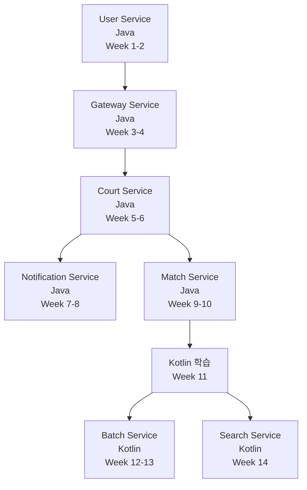

---
tags:
  - project
  - rally-point
  - roadmap
  - summary
category: project
status: active
created: 2025-11-16
modified: 2025-11-16
---
# 🎯 RallyPoint 조정된 개발 로드맵 요약

## 📝 조정 사항

### 1. 언어 전략 변경
**이전 계획**:
- Court, Match, Batch, Search Service 모두 Kotlin

**조정된 계획**:
- ✅ **핵심 비즈니스 서비스**: Java로 개발 (익숙도 고려)
  - User Service (Java) - 현재
  - Gateway Service (Java)
  - Court Service (Java)
  - Notification Service (Java)
  - Match Service (Java)

- 📚 **부가 서비스**: Kotlin 학습 겸 개발
  - Batch Service (Kotlin) - Week 12-13
  - Search Service (Kotlin) - Week 14

### 2. 개발 순서 변경
**이전 계획**: User → Court → Match → Gateway

**조정된 계획**: User → **Gateway** → Court → Notification → Match → Batch/Search
- Gateway를 먼저 구축하여 MSA 통합 환경 구축
- 도메인 의존성 및 테스트 용이성 고려

---

## 🗓️ 14주 개발 스케줄

### Phase 1: 기반 구축 (Week 1-4)
| Week | 서비스 | 언어 | 핵심 목표 |
|------|--------|------|-----------|
| 1-2 | User Service | Java | JWT Refresh Token, 이메일 인증, Docker Compose 환경 |
| 3-4 | Gateway Service | Java | 라우팅, JWT 검증, Rate Limiting |

**학습 포인트**: MSA 기초, DDD, Spring Cloud Gateway, Docker

---

### Phase 2: 핵심 비즈니스 로직 (Week 5-10)
| Week | 서비스 | 언어 | 핵심 목표 |
|------|--------|------|-----------|
| 5-6 | Court Service | Java | 예약 시스템, Redis 분산 락, 캐싱 |
| 7-8 | Notification Service | Java | Kafka Consumer, 이벤트 주도 아키텍처 |
| 9-10 | Match Service | Java | WebSocket 실시간 중계, OpenFeign |

**학습 포인트**: Redis, Kafka, 이벤트 주도 아키텍처, WebSocket, Circuit Breaker

---

### Phase 3: Kotlin 학습 및 부가 서비스 (Week 11-14)
| Week | 서비스 | 언어 | 핵심 목표 |
|------|--------|------|-----------|
| 11 | Kotlin 학습 | Kotlin | Kotlin 기초 문법, Spring Boot Kotlin, Todo API 실습 |
| 12-13 | Batch Service | Kotlin | Spring Batch, 만료 예약 정리, 통계 보고서 |
| 14 | Search Service | Kotlin | Elasticsearch, Kafka 파이프라인, 통합 테스트 |

**학습 포인트**: Kotlin 기본, Spring Batch, Elasticsearch, 성능 최적화

---

## 📊 서비스별 개발 순서 및 의존성

---

## 🎓 학습 경로

### Java 중심 학습 (Week 1-10)
1. **MSA 기초**: "Building Microservices" (Sam Newman)
2. **이벤트 주도**: "Kafka: The Definitive Guide"
3. **분산 시스템**: "Designing Data-Intensive Applications"
4. **패턴**: "Microservices Patterns", "Release It!"

### Kotlin 학습 (Week 11-14)
1. **Kotlin 기초**: "Kotlin in Action"
2. **Spring + Kotlin**: Baeldung Kotlin Tutorials
3. **실습**: Todo API → Batch Service → Search Service

---

## 🔑 핵심 장점

### 1. 학습 곡선 완화
- Java로 MSA 핵심 개념 익히기
- Kotlin은 부가 서비스로 점진적 학습
- 익숙한 언어로 복잡한 비즈니스 로직 구현

### 2. 빠른 MVP 구축
- Week 10까지 핵심 기능 완성 (예약, 중계, 알림)
- Java로 빠르게 개발 진행
- 통합 테스트 및 피드백 빠르게 반영

### 3. 점진적 기술 확장
- Week 1-10: Java + MSA 패턴 집중
- Week 11: Kotlin 학습 집중
- Week 12-14: Kotlin 실전 적용

---

## ✅ 체크포인트

### Week 4 (Gateway 완성 후)
- [ ] 모든 서비스 라우팅 테스트
- [ ] JWT 인증 흐름 확인
- [ ] 통합 환경 구축 완료

### Week 10 (Match Service 완성 후)
- [ ] 핵심 비즈니스 플로우 동작 확인
  - 회원가입 → 예약 → 매치 → 알림
- [ ] WebSocket 실시간 중계 테스트
- [ ] Kafka 이벤트 흐름 검증

### Week 14 (전체 완성 후)
- [ ] End-to-End 통합 테스트
- [ ] 성능 테스트 (예약 동시성, WebSocket 부하)
- [ ] 모니터링 대시보드 확인
- [ ] API 문서 통합

---

## 🚀 Week 1 시작 준비

### 다음 주부터 할 일
1. **User Service 완성**
   - [ ] JWT Refresh Token 구현
   - [ ] 이메일 인증 프로세스
   - [ ] MSA 내부 API (/internal/users/{userId}/verify)

2. **Docker Compose 환경**
   - [ ] MySQL, Redis, Kafka 컨테이너 설정
   - [ ] 개발 환경 스크립트 작성

3. **Common 라이브러리 생성**
   - [ ] 공통 DTO, 예외 클래스
   - [ ] Kafka 공통 설정

### 필요한 도구 설치
- [ ] Docker Desktop
- [ ] Redis Insight (Redis GUI)
- [ ] Kafka UI (Conduktor 또는 Kafdrop)
- [ ] Postman (API 테스트)

---

## 📚 다음 문서

- [[weekly-development-plan]] - 주차별 상세 계획
- [[msa-event-driven-learning-guide]] - MSA 학습 가이드
- [[project-structure]] - 프로젝트 구조 상세
- [[architecture]] - 전체 아키텍처
- [[user-domain]] - User Service 현재 상태

---

**작성일**: 2025-11-16
**작성자**: Claude Code
**상태**: Final v2.0 (조정 완료)
