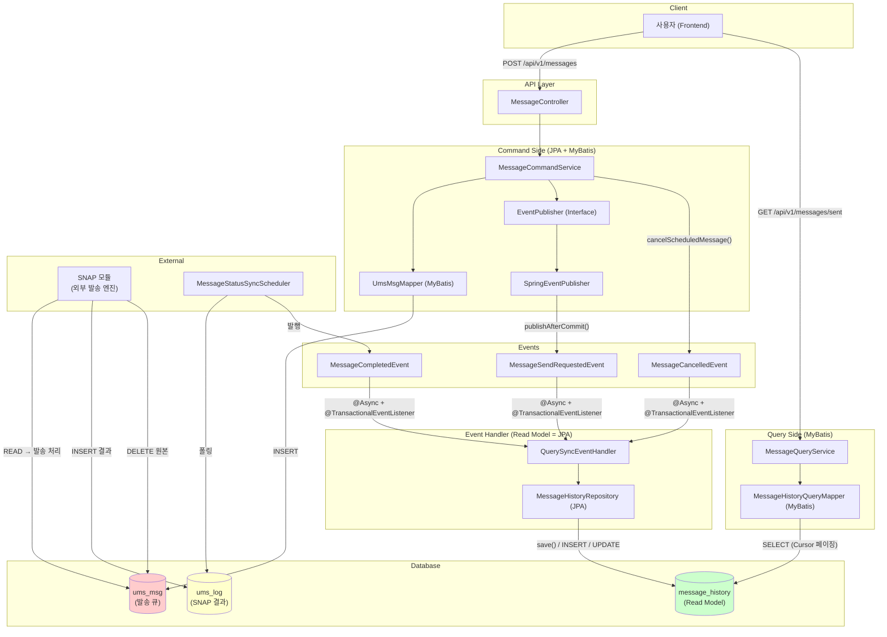
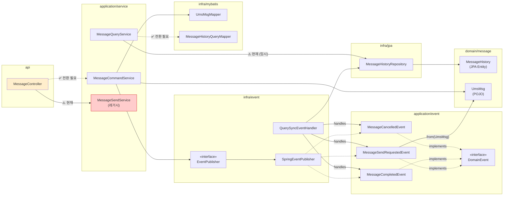
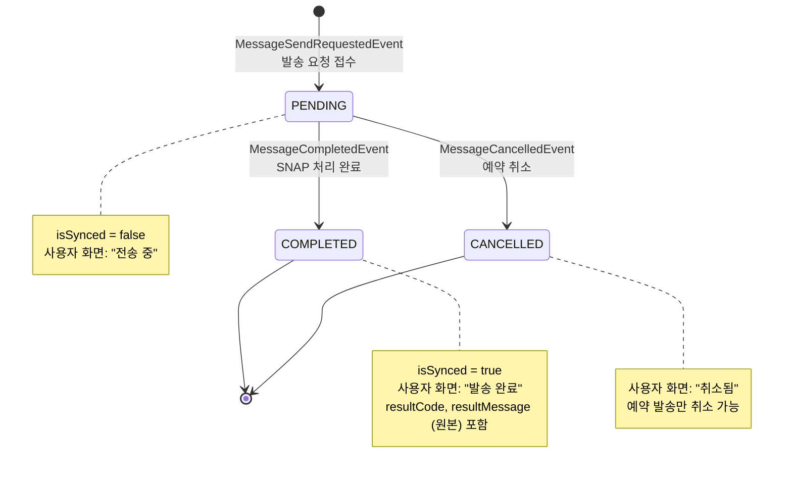

# LinkWave 사례로 분석하는 Event-Driven Architecture (EDA): 메시지 히스토리 구현 전략

> LinkWave 프로젝트의 메시지 발송 이력 구현 과정을 통해 Event-Driven Architecture(EDA)와 CQRS 패턴을 실제 시스템에 적용하는 방법을 상세히 설명합니다. SNAP과 같은 외부 모듈과의 통합, 데이터 흐름 전략, 그리고 서비스 확장을 위한 Kafka 도입까지, 설계 결정의 근거와 실전적인 구현 팁을 제시합니다.

---

## 개요
이 문서는 LinkWave의 메시지 발송 이력(message_history) 구현을 사례로 Event-Driven Architecture(EDA)를 심층 분석합니다. SNAP과 같이 우리가 제어할 수 없는 외부 모듈과의 협업 환경에서 발생하는 데이터 정합성 문제, 응답 속도, 시스템 확장성 등의 복합적인 문제를 이벤트 드리븐 방식으로 어떻게 해결했는지, 설계 결정의 근거와 실전적인 구현 과정을 상세히 설명합니다. 발송과 이력 저장을 별개의 관심사로 분리하고, 비동기 처리를 통해 응답 속도를 향상시키며, 미래의 Kafka 도입을 염두에 둔 추상화 전략을 포함하여 시스템 전반의 유연성과 확장성을 확보하는 방안을 다룹니다.

## 본문

### 1. 왜 이벤트 드리븐인가 — 설계 결정의 근거

LinkWave의 메시지 발송은 **우리가 제어할 수 없는 외부 모듈(SNAP)** 과 협업합니다. `ums_msg` 테이블에 메시지를 `INSERT`하면 `SNAP`이 이를 가져가 발송하고, 결과를 `ums_log`에 `INSERT`한 뒤 `ums_msg`에서 원본을 `DELETE`합니다.

이 구조에서 발생하는 근본적인 문제는 다음과 같습니다.
-   **ums_msg가 사라진다**: `SNAP`이 처리 후 `DELETE`하므로 발송 이력을 `ums_msg`에서 조회할 수 없습니다.
-   **ums_log는 월별 파티션**: `ums_log`는 월별로 파티션되어 있어 (`ums_log_202601`, `ums_log_202602` 등) 여러 테이블을 `UNION`해야 하는 복잡성이 있습니다. 또한 전체 시스템의 모든 발송 이력을 담고 있어 LinkWave 사용자 데이터만 추출하기 어렵습니다.
-   **중간 상태가 순식간**: `ready → pre-send → request → (삭제)` 과정이 수 밀리초 안에 끝나 데이터 추적이 어렵습니다.

이러한 문제들을 해결하고 시스템의 안정성과 확장성을 확보하기 위해 이벤트 드리븐 아키텍처를 선택했습니다.

#### 1.1 이벤트 드리븐을 선택한 5가지 근거

1.  **발송과 이력은 별개의 관심사**: 이력 저장 실패가 발송 자체의 롤백으로 이어지지 않도록, 발송(`ums_msg` `INSERT`)과 이력 저장(`message_history` `INSERT`)을 분리하여 핵심 기능의 안정성을 보장합니다.
2.  **응답 속도 향상**: `ums_msg` `INSERT` 후 이벤트를 발행하고 즉시 응답을 반환하여 사용자 경험을 개선합니다. 이력 저장은 별도 스레드에서 비동기 처리됩니다.
3.  **확장 포인트**: 이벤트를 발행하면 `MessageCommandService`를 수정하지 않고도 리스너만 추가하여 통계 집계, 알림 전송, 감사 로그 등 다양한 후속 작업을 유연하게 확장할 수 있습니다.
4.  **메시징 인프라로의 자연스러운 전환**: `EventPublisher` 인터페이스를 추상화하여 Spring Event에서 Kafka와 같은 메시징 시스템으로의 전환이 비즈니스 코드 변경 없이 이루어질 수 있도록 설계합니다.
5.  **SNAP 결과 동기화와의 일관성**: 발송 요청과 결과 동기화 모두 이벤트 기반 패턴으로 처리하여 시스템 전체의 일관성을 유지합니다.

---


### 2. 전체 아키텍처

#### 2.1 시스템 전체 흐름



#### 2.2 컴포넌트 의존성 맵



#### 2.3 메세지 상태 흐름 (State Diagram)



---


### 3. SNAP 연동과 데이터 흐름 전략

`SNAP` 모듈은 `ums_msg`에서 데이터를 읽어 처리한 후 `ums_log`로 이동시키고 원본을 삭제합니다. 따라서 우리는 두 단계로 나누어 이력을 저장해야 합니다.

**💡 설계 근거: 왜 2단계(PENDING → COMPLETE)인가?**
1.  **SNAP의 블랙박스 특성**: `ums_msg`에 넣으면 언젠가 사라지고, `ums_log`에 결과가 생깁니다. 그 중간 과정(`pre-send` 등)은 너무 빨라서 잡기 힘들고, 삭제 타이밍과 겹치면 데이터가 증발한 것처럼 보일 수 있습니다. (Race Condition)
2.  **데이터 정합성**: "내가 요청했다(PENDING)"는 사실만 먼저 기록하고, 확실한 "결과(COMPLETE)"가 나왔을 때 업데이트하는 것이 가장 안전합니다. 중간 상태를 어설프게 추적하려다간 "보냈는데 이력이 없는" 최악의 버그를 만날 수 있습니다.

#### 3.1 단계 1: 발송 요청 시점 (실시간 이벤트)
-   **트리거**: `MessageCommandService`가 `ums_msg`에 저장 완료 후 `MessageSendRequestedEvent` 발행
-   **처리**: `QuerySyncEventHandler`가 이벤트 수신 → `message_history`에 `PENDING` 상태로 저장 (JPA)
-   **사용자 경험**: 발송 즉시 "보낸 메세지함"에서 '전송 중' 상태 확인 가능

#### 3.2 단계 2: 발송 완료 시점 (비동기 동기화)
-   **트리거**: 스케줄러가 `ums_log` 테이블을 주기적으로 폴링하여 결과 확인
-   **처리**: 결과 확인 시 `MessageCompletedEvent` 발행 → `QuerySyncEventHandler`가 `message_history` 상태를 `COMPLETED`로 업데이트하며 원본 결과를 저장 (JPA)
-   **사용자 경험**: 보낸 메세지함(MyBatis 조회)에서 최종 결과 확인

#### 3.3 중간 상태 (pre-send, request) 처리 전략
-   **전략**: **중간 상태 무시, 최종 결과 집중**. 사용자에게는 `PENDING(전송 중)` 하나로 통합하여 보여줍니다. `ums_log`에 결과가 나오면 바로 `COMPLETED`로 업데이트하며 원본 결과를 노출합니다.

---


### 4. 구현된 코드 구조

#### 4.1 이벤트 정의

세 가지 도메인 이벤트가 정의되어 있으며, 모두 `DomainEvent` 인터페이스를 구현합니다.
**💡 설계 근거: `DomainEvent` 인터페이스**
단순 POJO나 Map을 쓰지 않고 인터페이스를 정의한 이유는 **표준화** 때문입니다. `eventId`, `occurredAt`, `version`과 같은 필드는 나중에 Kafka 등으로 확장할 때 필수적인 역할을 합니다.

| 이벤트 | 발행 시점 | 역할 |
|--------|---------|------|
| `MessageSendRequestedEvent` | `ums_msg` 저장 후 | `message_history` PENDING 생성 |
| `MessageCompletedEvent` | `ums_log` 결과 확인 후 | `message_history` 상태 업데이트 |
| `MessageCancelledEvent` | 예약 메세지 취소 시 | `message_history` CANCELLED 처리 |

#### 4.2 Command Side: 이벤트 발행

`EventPublisher`의 `publishAfterCommit()`이 핵심입니다. 이벤트를 먼저 발행하고 트랜잭션이 롤백되면 실제 데이터는 저장 안 됐는데 이벤트 리스너는 "저장됐다"고 착각하고 후속 처리를 할 수 있습니다. 이를 막기 위해 **트랜잭션이 성공적으로 커밋된 후에만** 이벤트를 발행하도록 보장합니다.

---


### 5. 구현 Phase 2 — Command Side

**목표**: 메시지 발송 시 `ums_msg` 저장 + 이벤트 발행

#### 5.1 MessageCommandService

**핵심 흐름**:
1.  발신번호 검증 (사용자 소유 여부)
2.  `batchKey` 생성 (같은 요청의 메시지 그룹 식별)
3.  수신자별 `UmsMsg` 생성
4.  `ums_msg` 일괄 저장 (MyBatis - SNAP이 처리할 큐)
5.  트랜잭션 커밋 후 `MessageSendRequestedEvent` 발행
6.  즉시 응답

#### 5.2 UmsMsg 필드 매핑 규약

`ums_msg` 테이블의 `ETC1~ETC6` 컬럼을 LinkWave 용도로 사용합니다:

| ETC 컬럼 | 용도 | 설명 |
|---------|------|------|
| `ETC1` | batchKey | 같은 요청으로 발송된 메시지 그룹 |
| `ETC2` | userId | 발송 요청한 사용자 ID |
| `ETC4` | 발송 유형 | "SCHEDULED" 또는 "IMMEDIATE" |

---


### 6. 구현 Phase 3 — Event Handler

**목표**: 이벤트를 수신하여 `message_history` (Read Model)를 JPA로 동기화

**💡 설계 근거: 비동기(`@Async`) 처리**
이력 저장은 **부가 작업**입니다. 이력 저장 때문에 사용자 응답이 느려지거나, 이력 DB 장애 때문에 발송 자체가 실패하면 안 됩니다. 메인 로직(발송)과 서브 로직(이력)을 분리하여 **장애 격리(Fault Tolerance)와 응답 속도 향상**을 꾀합니다.

#### 6.1 QuerySyncEventHandler

**파일**: `infra/event/QuerySyncEventHandler.java`

```java
@Component
@RequiredArgsConstructor
@Slf4j
public class QuerySyncEventHandler {

    private final MessageHistoryRepository messageHistoryRepository;

    // ── 발송 요청 이벤트 → PENDING 생성 ──
    @Async("eventExecutor")
    @TransactionalEventListener(phase = TransactionPhase.AFTER_COMMIT)
    public void handleMessageSendRequested(MessageSendRequestedEvent event) {
        // ... message_history에 PENDING 상태로 저장 (JPA) ...
    }

    // ── 완료 메시지 이벤트 → 상태 업데이트 ──
    @Async("eventExecutor")
    @TransactionalEventListener(phase = TransactionPhase.AFTER_COMMIT)
    public void handleMessageCompleted(MessageCompletedEvent event) {
        // ... message_history 상태를 COMPLETED로 변경하고 원본 결과 저장 (JPA Dirty Checking) ...
    }

    // ── 취소 메시지 이벤트 → CANCELLED 처리 ──
    @Async("eventExecutor")
    @TransactionalEventListener(phase = TransactionPhase.AFTER_COMMIT)
    public void handleMessageCancelled(MessageCancelledEvent event) {
        // ... CANCELLED 처리 ...
    }
}
```

---


### 7. 구현 Phase 4 — Query Side (사용자 조회)

**💡 설계 근거: 왜 MyBatis인가?**
1.  **Cursor Pagination**: JPA로 커서 기반 페이징을 구현하는 것은 복잡하며 쿼리 튜닝이 어렵습니다. MyBatis는 SQL을 직접 작성하므로 인덱스 힌트나 복잡한 WHERE 절 최적화가 직관적입니다.
2.  **데이터 조회 전용**: 조회용 모델(DTO)은 엔티티와 다릅니다. 불필요한 연관 관계 로딩 없이 필요한 컬럼만 가져오기 위해 MyBatis가 유리합니다.
3.  **통계 쿼리**: `GROUP BY date, status`와 같은 집계 쿼리는 ORM보다 SQL이 훨씬 강력합니다.

#### 7.1 MessageHistoryQueryMapper (MyBatis)

**파일**: `infra/mybatis/mapper/MessageHistoryQueryMapper.java`

```java
@Mapper
public interface MessageHistoryQueryMapper {
    // 1. 보낸 메시지 목록 (Cursor Pagination)
    List<MessageHistoryListDto> findSentMessages(
        @Param("userId") String userId,
        @Param("status") String status,
        @Param("cursorRequestedAt") LocalDateTime cursorRequestedAt,
        @Param("cursorId") String cursorId,
        @Param("limit")int limit
    );

    // 2. 메시지 상세 조회
    MessageHistoryDetailDto findByClientKeyAndUserId(...);

    // 3. 통계 (상태별 카운트)
    List<MessageStatusCountDto> countByUserIdGroupByStatus(@Param("userId") String userId);
}
```

#### 7.2 MessageHistoryQueryMapper.xml (SQL)

**파일**: `resources/mybatis/mapper/MessageHistoryQueryMapper.xml`

```xml
<select id="findSentMessages" resultType="...MessageHistoryListDto">
    SELECT 
        client_key, message_type, recipient_phone, status, requested_at
    FROM message_history
    WHERE user_id = #{userId}
    <if test="status != null">AND status = #{status}</if>
    
    <!-- 커서 조건 (No-Offset 페이징) -->
    <if test="cursorRequestedAt != null and cursorId != null">
        AND (
            requested_at < #{cursorRequestedAt}
            OR (requested_at = #{cursorRequestedAt} AND client_key < #{cursorId})
        )
    </if>
    
    ORDER BY requested_at DESC, client_key DESC
    LIMIT #{limit}
</select>
```

---


### 8. 구현 Phase 5 — SNAP 결과 동기화 스케줄러

**목표**: `ums_log`를 주기적으로 확인하여, 완료된 건들을 `message_history`에 반영

#### 8.1 MessageStatusSyncScheduler

**파일**: `application/scheduler/MessageStatusSyncScheduler.java`

```java
@Component
@RequiredArgsConstructor
@Slf4j
public class MessageStatusSyncScheduler {

    private final MessageHistoryRepository messageHistoryRepository; // JPA
    private final UmsLogMapper umsLogMapper;  // MyBatis
    private final EventPublisher eventPublisher;

    @Scheduled(fixedDelay = 60000) // 1분 주기
    @Transactional
    public void syncMessageStatus() {
        // 1. 미동기화 건 조회 (JPA - 상태변경을 위한 조회)
        // 성능 고려: 최근 3일 이내 데이터만 조회하도록 인덱스 타는 조건 추가 권장
        Instant since = Instant.now().minus(Duration.ofDays(3));
        
        List<MessageHistory> pendingList = 
            messageHistoryRepository.findUnsyncedMessages(since, PageRequest.of(0, 500));

        if (pendingList.isEmpty()) return;

        log.info("Syncing {} pending messages...", pendingList.size());

        for (MessageHistory history : pendingList) {
            processSingleHistory(history);
        }
    }
    
    private void processSingleHistory(MessageHistory history) {
        // 2. ums_log에서 결과 조회 (MyBatis)
        UmsLogResult logResult = umsLogMapper.findByClientKey(history.getClientKey());
        
        if (logResult != null) {
            // 3. 완료 이벤트 발행 (→ QuerySyncEventHandler가 처리)
            MessageCompletedEvent event = MessageCompletedEvent.from(logResult);
                
            eventPublisher.publish(event); // 여기서는 트랜잭션 내 즉시 발행해도 무방
        }
    }
}
```

---


### 9. 구현 Phase 6 — 예약 발송 취소

예약 발송 취소 시 `ums_msg`에서 삭제하고 `message_history`를 CANCELLED로 변경합니다.

#### 9.1 MessageCommandService.cancel()

```java
@Transactional
public void cancelScheduledMessage(String clientKey, UUID userId) {
    // 1. 권한 확인 & 예약 상태인지 확인 (JPA Read Model 활용)
    MessageHistory history = messageHistoryRepository.findByClientKeyAndUserId(clientKey, userId.toString())
        .orElseThrow(() -> new BusinessException(ErrorCode.MESSAGE_NOT_FOUND));

    if (!history.isPending() || !history.isScheduled()) {
        throw new BusinessException(ErrorCode.CANNOT_CANCEL_MESSAGE);
    }

    // 2. ums_msg 삭제 (MyBatis)
    int deleted = umsMsgMapper.deleteByClientKey(clientKey);
    if (deleted == 0) {
        // 이미 발송되었거나 존재하지 않음
        throw new BusinessException(ErrorCode.MESSAGE_ALREADY_SENT);
    }

    // 3. 취소 이벤트 발행 (→ QuerySyncEventHandler가 처리)
    eventPublisher.publishAfterCommit(
        new MessageCancelledEvent(clientKey, userId.toString())
    );
}
```

---


### 10. 구현 Phase 7 — 데이터 정리 (Retention)

`message_history`는 영구 보관용이 아닙니다. (영구 보관은 `ums_log`가 담당)
빠른 조회를 위해 최근 3개월~6개월 데이터만 유지합니다.

```sql
-- 매일 밤 실행되는 이벤트 또는 배치
DELETE FROM message_history 
WHERE requested_at < DATE_SUB(NOW(), INTERVAL 3 MONTH);
```

---


### 11. 구현 Phase 8 — 메트릭 수집 (Prometheus + Grafana)

운영 단계에서 `QuerySyncEventHandler`에 메트릭을 심어 모니터링합니다.

| 메트릭 이름 | Type | Tags | 설명 |
|------------|------|------|------|
| `message_sent_total` | Counter | `status={success|fail}` | 발송 완료 건수 |
| `message_queue_lag` | Gauge | - | `ums_msg` 적재 후 처리 대기 시간 |
| `sync_job_duration` | Timer | - | 동기화 스케줄러 실행 시간 |

---


### 12. 확장 전략 — Kafka 도입 (1000+ TPS)

트래픽이 폭주하여 `ums_msg` DB가 병목이 되거나, `SyncScheduler`가 밀리기 시작하면 Kafka를 도입합니다.

1.  **EventPublisher 교체**: `SpringEventPublisher` → `KafkaEventPublisher`
2.  **Consumer 분리**: `QuerySyncEventHandler`를 별도 Spring Boot 애플리케이션(`linkwave-worker`)으로 분리
3.  **흐름**:
    `API Server` → (Kafka) → `Worker` → `message_history` INSERT

기존 비즈니스 로직(`MessageCommandService`)은 수정할 필요가 없습니다.

---


### 13. 남은 구현 과제 (To-Do Checklist)

이제 **이 가이드를 따라 직접 구현해야 할 과제들**입니다. (구현의 편의를 위해 순서를 조정했습니다)

#### ⬜ 과제 3 (우선순위 1): `MessageController` 리팩토링

현재 컨트롤러가 이벤트를 발행하지 않는 레거시 서비스(`MessageSendService`)를 사용하고 있습니다. 
이를 이벤트 기반의 `MessageCommandService`로 교체해야 `message_history`에 데이터가 쌓이기 시작합니다.

```diff
 public class MessageController {
-    private final MessageSendService messageSendService;
+    private final MessageCommandService messageCommandService;
     
     @PostMapping
     public ResponseEntity<MessageResponse> sendMessage(...) {
         // ...
-        return messageSendService.sendMessage(request);
+        return messageCommandService.sendMessage(SendMessageCommand.from(request), userId);
     }
```

#### ⬜ 과제 2 (우선순위 2): `MessageQueryService` MyBatis 전환

현재 `MessageQueryService`는 JPA 레포지토리(`MessageHistoryRepository`)를 사용하여 전체 목록을 가져오는 임시 코드로 되어 있습니다.
위에서 설명한 `MessageHistoryQueryMapper`(MyBatis)를 사용하도록 변경하여 커서 페이징을 지원해야 합니다.

```java
// 변경 전 (JPA)
messageHistoryRepository.findAllByUserId(userId, pageable);

// 변경 후 (MyBatis)
messageHistoryQueryMapper.findSentMessages(userId, status, cursorVal, cursorId, limit);
```

#### ⬜ 과제 1 (우선순위 3): SNAP 동기화 스케줄러 구현

`ums_log` 테이블을 폴링하여 `MessageCompletedEvent`를 발행하는 스케줄러(`MessageStatusSyncScheduler`)를 새로 만들어야 합니다.
이게 없으면 메시지 상태가 영원히 `PENDING`으로 남습니다.

```java
@Scheduled(fixedDelay = 60000)
public void sync() {
    // 1. findUnsyncedMessages (JPA)
    // 2. findByClientKey (MyBatis -> ums_log)
    // 3. eventPublisher.publish(MessageCompletedEvent)
}
```

#### ⬜ 과제 4 (선택): 메트릭 수집

`QuerySyncEventHandler`나 스케줄러에 `MeterRegistry`를 주입받아 카운터를 증가시킵니다.
- `message.sent.count` (tag: result=raw_code)
- `message.sync.job.duration`

---


### 14. 핵심 Q&A

#### Q1. 왜 이벤트(비동기)를 사용하나요? DB에 두 번 insert 하면 안 되나요?

**결합도를 낮추고 성능을 확보하기 위해서입니다.**

-   **성능**: `ums_msg` 저장 후 바로 응답. `message_history` 저장은 별도 스레드에서 비동기 처리하므로 사용자 응답이 빠릅니다.
-   **결합도**: 이력 저장 로직이 실패해도 발송 요청 자체는 성공합니다. 또한, 나중에 "발송 성공 시 알림톡 전송" 같은 기능을 추가할 때 `MessageCommandService` 코드를 건드리지 않고 리스너만 추가하면 됩니다.

#### Q2. RabbitMQ/Kafka가 꼭 필요한가요?

**현재 트래픽(300 TPS 이하)에서는 Spring Event로 충분합니다.**
메모리 기반이라 서버가 다운되면 이벤트가 유실될 수 있지만, `ums_msg`와 `ums_log`가 원장(Source of Truth)으로 남아있으므로 `SyncScheduler`가 나중에 복구해줍니다.
1000 TPS 이상으로 넘어가면 그때 Kafka 도입을 고려하면 됩니다.

#### Q3. 무료 모니터링/메트릭 도구는?

-   **수집**: **Prometheus** (Spring Boot Actuator와 표준 연동)
-   **시각화**: **Grafana** (대시보드 무료)

---


### 15. 시니어의 조언 — 초급 개발자를 위한 인사이트

1.  **"돌아가는 코드"가 먼저입니다.**
    Kafka, MSA, Event Sourcing 같은 거창한 용어에 매몰되지 마세요.
    지금은 **JPA로 저장하고 MyBatis로 조회하는** 기본 사이클을 완성하는 게 가장 중요합니다.

2.  **로그를 믿으세요.**
    `QuerySyncEventHandler`에 로그(`log.info`)를 꼼꼼히 남기세요.
    비동기 시스템은 디버깅이 어렵습니다. 로그만이 살길입니다.

3.  **실패를 가정하세요.**
    "INSERT가 실패하면 어떡하지?", "이벤트가 안 날아가면 어떡하지?"
    이런 고민이 `publishAfterCommit` 같은 견고한 코드를 만듭니다.

4.  **문서를 곁에 두세요.**
    이 가이드를 띄워놓고 코드를 작성하세요. 길을 잃었을 때 나침반이 될 겁니다.

Good Luck, LinkWave Team! 🚀