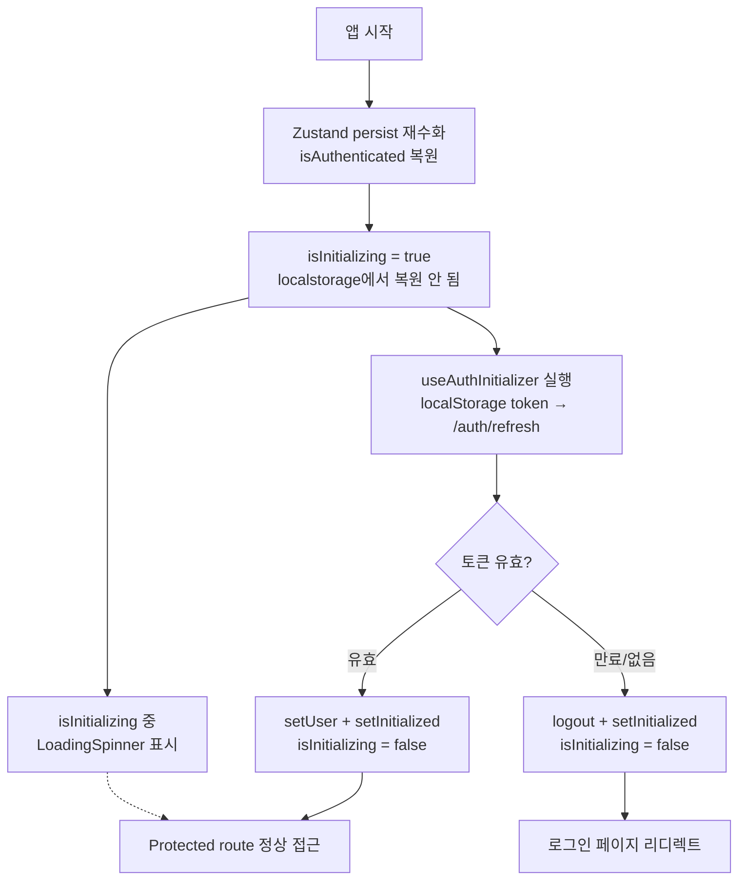

---
tags:
  - frontend
  - react
  - zustand
  - auth
  - state-management
  - typescript
category: resource
created: 2026-03-19
related:
  - TanStack
  - react-notes
  - typescript-api-layer-patterns
---

# 🔍 Zustand persist + 인증 초기화 패턴

> localStorage 재수화(rehydration) 문제와 `isInitializing` 상태 분리를 통한 페이지 로드 시 인증 검증 흐름

---

## 📌 Situation / Symptom

SPA에서 Zustand `persist` 미들웨어를 사용해 인증 상태를 localStorage에 저장하면 다음 문제가 발생한다:

1. 페이지 새로고침 시 `isAuthenticated: true`가 localStorage에서 즉시 복원됨
2. 서버에서 토큰 검증 없이 로그인된 UI가 렌더링됨
3. 토큰이 실제로 만료됐거나 서버에서 무효화됐어도 UI는 로그인 상태를 표시

```
localStorage → Zustand store 재수화
    ↓
isAuthenticated = true (검증 없음)
    ↓
Protected route → 바로 접근 허용
    ↓ (API 호출 시)
401 Unauthorized → 갑작스러운 로그아웃
```

---

## 🔍 Technical Analysis

### 1. 문제 원인: persist 재수화의 즉시성

Zustand `persist`는 앱 마운트 시 localStorage 데이터를 **동기적**으로 store에 주입한다. 이 시점에는 서버 검증이 아직 시작되지 않았다.

```typescript
// 이 상태가 localStorage에서 즉시 복원됨
const useAuthStore = create(
  persist(
    (set) => ({
      isAuthenticated: false,
      user: null,
      token: null,
    }),
    { name: 'auth-storage' }
  )
)
```

React Query나 `useEffect`의 silent refresh는 **비동기**이므로, 복원과 검증 사이에 "검증되지 않은 로그인 상태"가 존재하는 타이밍 갭이 생긴다.

---

### 2. 해결: isInitializing 상태를 persist 파티션에서 분리

`isInitializing` 필드를 persist 대상에서 **의도적으로 제외**한다. persist 미들웨어의 `partialize` 옵션으로 persist 대상 필드만 지정한다.

```typescript
// authStore.ts
interface AuthState {
  // persist 대상 (localStorage에 저장)
  isAuthenticated: boolean
  user: User | null
  token: string | null

  // persist 비대상 (앱 재시작 시 항상 초기값)
  isInitializing: boolean  // ← 항상 true로 시작
}

const useAuthStore = create<AuthState>()(
  persist(
    (set, get) => ({
      isAuthenticated: false,
      user: null,
      token: null,
      isInitializing: true,  // persist 되지 않으므로 항상 true로 시작

      restoreSession: async () => {
        // silent refresh 로직
      },
      setInitialized: () => set({ isInitializing: false }),
    }),
    {
      name: 'auth-storage',
      partialize: (state) => ({
        // isInitializing 제외 — persist 안 함
        isAuthenticated: state.isAuthenticated,
        user: state.user,
        token: state.token,
      }),
    }
  )
)
```

**효과**: 앱이 재시작될 때마다 `isInitializing`은 항상 `true`로 초기화된다. 이 값은 localStorage에서 복원되지 않으므로, silent refresh가 완료되기 전까지 `true` 상태를 유지한다.

---

### 3. 초기화 흐름



---

### 4. 컴포넌트 계층에서의 처리

```typescript
// hooks/useAuthInitializer.ts
export function useAuthInitializer() {
  const { token, restoreSession, setInitialized } = useAuthStore()

  useEffect(() => {
    if (token) {
      restoreSession().finally(setInitialized)
    } else {
      setInitialized()
    }
  }, []) // 앱 전체 생명주기에서 한 번만 실행
}

// __root.tsx — 전역 초기화
function RootComponent() {
  useAuthInitializer()  // 앱 최상위에서 한 번 호출
  return <Outlet />
}

// _authenticated.tsx — 인증 가드
function AuthenticatedLayout() {
  const { isAuthenticated, isInitializing } = useAuthStore()

  if (isInitializing) return <LoadingSpinner />  // 검증 완료 대기
  if (!isAuthenticated) return <Navigate to="/login" />

  return <Outlet />
}
```

> [!tip] Best Practice
> `useAuthInitializer()`는 앱 루트 레이아웃(`__root.tsx`)에서 딱 한 번 호출한다.
> 각 보호된 레이아웃(`_authenticated`, `super-admin` 등)은 `isInitializing` 여부만 체크해 스피너를 표시하면 된다.
> silent refresh 로직이 중복 실행되지 않도록 `useEffect` dependency array를 `[]`로 고정한다.

---

### 5. persist 파티션 분리 패턴의 일반화

이 패턴은 인증 외에도 "앱 시작 시 항상 초기화가 필요한 상태"에 범용적으로 적용 가능하다.

| 상태 유형 | persist 여부 | 이유 |
|-----------|-------------|------|
| 사용자 정보, 토큰 | ✅ | 새로고침 후 유지 필요 |
| `isInitializing` | ❌ | 앱 시작 시 항상 검증 필요 |
| 로딩 상태 (`isLoading`) | ❌ | 일시적 UI 상태 |
| 에러 상태 | ❌ | 이전 에러가 복원되면 UX 오염 |
| 모달/드로어 열림 상태 | ❌ | 세션 간 유지 불필요 |

> [!warning] persist + 비동기 초기화 조합 주의사항
> localStorage 재수화 시 사용자 정보는 복원되지만 **서버 세션은 검증되지 않은 상태**다.
> API 호출에서 401이 발생하면 silent refresh를 재시도하는 인터셉터 로직과 병행하면 더 견고해진다.

---

## 🔗 Related Concepts

- [[resource/topics/frontend/react/TanStack|TanStack Query — 서버 상태 관리]]
- [[resource/topics/frontend/react/react-notes|React 핵심 노트]]
- [[resource/topics/frontend/typescript/typescript-api-layer-patterns|TypeScript API 레이어 패턴]]
- [[resource/topics/frontend/typescript/type-system-basics|TypeScript 타입 시스템 기초]]

---

## 📚 References

- [Zustand persist middleware](https://github.com/pmndrs/zustand/blob/main/docs/integrations/persisting-store-data.md)
- [Zustand partialize option](https://github.com/pmndrs/zustand/blob/main/docs/integrations/persisting-store-data.md#partialize)

---

*Last updated: 2026-03-19*
