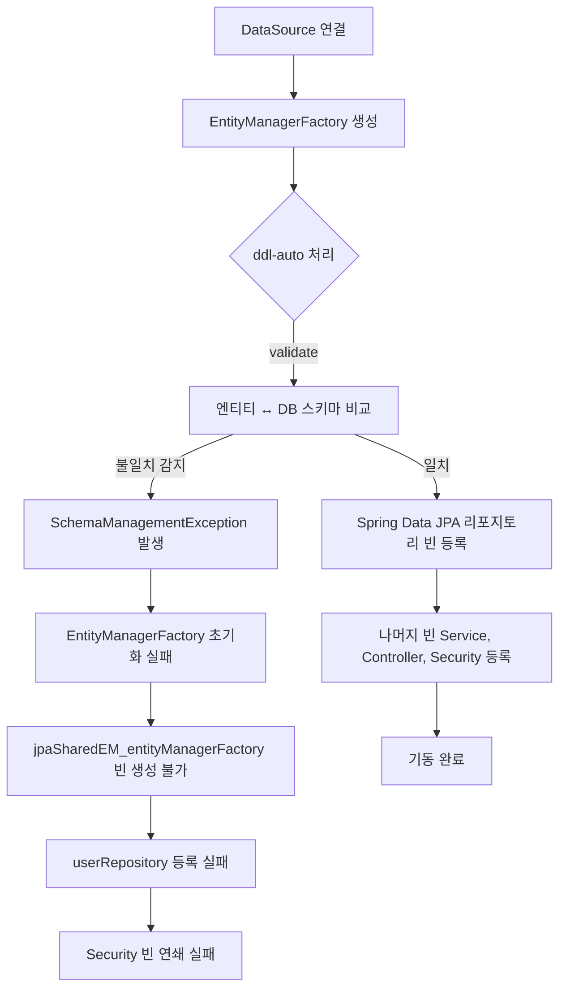

---
tags:
  - backend
  - spring
  - jpa
  - hibernate
  - database
  - troubleshooting
category: resource
created: 2026-03-24
related:
  - spring-transactional-deep-dive
  - spring-boot-best-practices
---

# 🔍 Hibernate `ddl-auto` 설정과 Spring Boot 기동 순서

## 📌 Situation / Symptom

JAR 배포 후 애플리케이션이 기동되지 않고 다음 에러 발생:

```
Error creating bean with name 'userRepository' defined in @EnableJpaRepositories declared on JpaConfig:
Cannot resolve reference to bean 'jpaSharedEM_entityManagerFactory'
while setting bean property 'entityManager'
```

에러 메시지만 보면 리포지토리나 `jpaSharedEM_` 빈 문제처럼 보이지만, 이것은 **cascading failure**다.
실제 근본 원인은 `EntityManagerFactory` 초기화 실패이며, 그 원인은 `ddl-auto: validate` 스키마 불일치다.

**에러 전파 체인:**

```
jwtAuthenticationFilter
  → customUserDetailService
    → userRepository
      → jpaSharedEM_entityManagerFactory  ← "없다"고 나오지만 여기가 근본이 아님
        → entityManagerFactory 초기화 실패
          → 근본 원인: ddl-auto: validate 스키마 불일치
```

---

## 🔍 Technical Analysis

### Spring Boot 기동 순서와 ddl-auto의 위치



**핵심 포인트**: `ddl-auto` 처리는 `EntityManagerFactory` 생성 단계에서 일어난다.
이 단계가 실패하면 그 이후에 등록되어야 할 모든 빈이 도미노처럼 실패한다.
따라서 에러 메시지에 나타나는 `userRepository`나 `jpaSharedEM_` 빈은 실제 원인이 아니다.

### jpaSharedEM_ 내부 빈 이름 규칙

Spring Data JPA는 `@EnableJpaRepositories(entityManagerFactoryRef = "entityManagerFactory")`에서
내부적으로 `jpaSharedEM_<entityManagerFactoryRef>` 형식의 빈을 생성한다.

- 패턴: `jpaSharedEM_<entityManagerFactoryRef>`
- 예: `jpaSharedEM_entityManagerFactory`

이 빈이 "없다"는 에러는 `EntityManagerFactory` 초기화가 먼저 실패했다는 신호다.
**진단 시 에러 스택 트레이스의 `Caused by:` 체인을 끝까지 따라가야 한다.**

### ddl-auto 옵션 비교

| 값 | 동작 | 스키마 변경 | 위험도 | 권장 환경 |
|---|---|---|---|---|
| `none` | 아무것도 안 함 | - | 없음 | 운영 (Flyway 사용 시) |
| `validate` | 엔티티 ↔ DB 스키마 검증, 불일치 시 기동 실패 | 없음 | 낮음 | 스테이징 안전망 |
| `update` | 엔티티 기준으로 스키마 추가/변경 (삭제는 안 함) | 추가/변경만 | 중간 | 로컬 개발 |
| `create` | 기동 시 스키마 DROP 후 CREATE | 전체 재생성 | 높음 | CI/테스트 |
| `create-drop` | 기동 시 CREATE, 종료 시 DROP | 전체 재생성+삭제 | 매우 높음 | 테스트 전용 |

> [!tip] Best Practice
> `validate`는 운영 배포 시 마이그레이션 누락을 잡아내는 안전장치로 설계된 설정이다.
> 코드(엔티티)와 DB가 정확히 일치해야만 기동이 허용된다.
> 로컬 개발에서는 `update`가 편리하지만, 운영에서는 `none` + Flyway/Liquibase 조합이 표준이다.

---

## 🛠 Solution

### 이번 케이스의 근본 원인

`fix: organization -> team` 커밋으로 엔티티 구조가 변경되었지만, 개발 서버 DB 스키마는 구버전(`organizations` 테이블)을 유지하고 있었다.
`ddl-auto: validate`가 기동 시 불일치를 감지하여 `EntityManagerFactory` 초기화를 중단시켰다.

**즉각 해결**: `ddl-auto: validate` → `ddl-auto: update`로 변경

```yaml
spring:
  jpa:
    hibernate:
      ddl-auto: update  # 개발 서버: 엔티티 기준으로 스키마 자동 보정
```

> [!warning] update의 함정
> `update`는 컬럼 추가는 하지만 **컬럼 삭제와 타입 변경은 하지 않는다.**
> `organizations` → `teams` 같은 테이블명 변경도 자동 처리되지 않는다. (구 테이블이 남고 새 테이블이 추가됨)
> 운영 환경에서 `update`를 사용하면 스키마가 조용히 오염될 수 있다.

### 운영 환경 올바른 패턴

운영에서는 `ddl-auto: none` + Flyway 조합이 표준이다.

```yaml
# application-prod.yml
spring:
  jpa:
    hibernate:
      ddl-auto: none  # Hibernate가 스키마에 손대지 않음

  flyway:
    enabled: true
    locations: classpath:db/migration
```

```
db/migration/
├── V1__init_schema.sql
├── V2__rename_organization_to_team.sql
└── V3__add_index.sql
```

Flyway는 기동 시 미실행 마이그레이션 스크립트를 버전 순서대로 실행한다.
스키마 변경 이력이 SQL 파일로 코드와 함께 버전 관리된다.

**환경별 권장 설정 요약:**

| 환경 | ddl-auto | 보조 도구 | 이유 |
|---|---|---|---|
| 로컬 개발 | `update` | - | 엔티티 변경마다 마이그레이션 파일 불필요 |
| CI/테스트 | `create-drop` | - | 매 테스트마다 깨끗한 상태 보장 |
| 스테이징 | `validate` | Flyway | 마이그레이션 적용 후 검증 |
| 운영 | `none` | Flyway | Hibernate가 스키마에 개입 안 함 |

---

## 🔗 Related Concepts

- [[resource/topics/spring/spring-transactional-deep-dive|Spring @Transactional 심층 분석]] — EntityManagerFactory와 트랜잭션 매니저 관계
- [[resource/topics/spring/spring-boot-best-practices|Spring Boot 실무 패턴]] — JPA 설정, Auditing, 테스트 전략
- [[resource/topics/spring/spring-event-design-domain-vs-infra|Spring 이벤트 설계]] — Bean 초기화 순서와 이벤트 연관성
- [[resource/topics/database/_Database MOC|Database MOC]] — DB 스키마 마이그레이션 전략

---

## 📚 References

- [Hibernate ORM - Schema management](https://docs.jboss.org/hibernate/orm/6.4/userguide/html_single/Hibernate_User_Guide.html#schema-generation)
- [Spring Boot - Database Initialization](https://docs.spring.io/spring-boot/docs/current/reference/html/howto.html#howto.data-initialization)
- [Flyway - Get Started](https://flywaydb.org/documentation/getstarted/)
