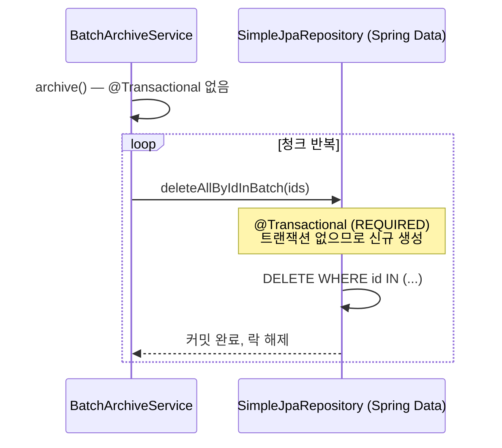
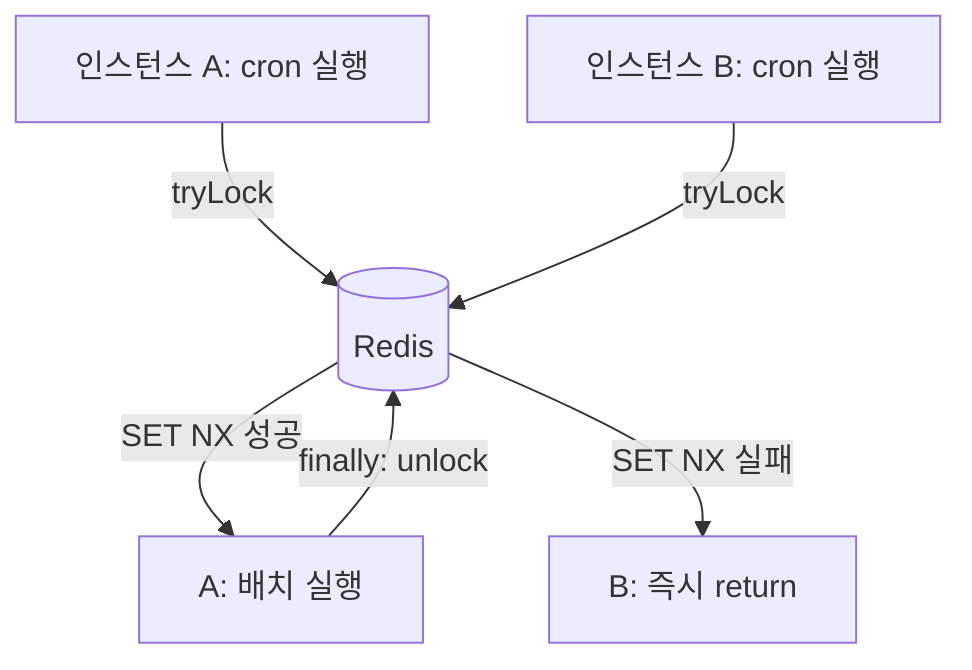

---
tags:
  - spring
  - batch
  - scheduler
  - transaction
  - redis
  - distributed-lock
  - jpa
  - backend
category: resource
created: 2026-03-30
related:
  - spring-aop-proxy-self-invocation
  - spring-transactional-deep-dive
  - spring-transaction-distributed-lock-redis
  - innodb-batch-delete-pattern
---

# 🔍 배치 스케줄러 구현 패턴: 청크 삭제 + 분산 락

> `@Transactional` 없이 SimpleJpaRepository 자체 트랜잭션을 활용하는 청크 삭제 루프, 그리고 Redis 분산 락으로 다중 인스턴스 중복 실행을 막는 스케줄러 설계

---

## 📌 Situation / Symptom

위반 로그 아카이브 배치를 구현하면서 두 가지 문제를 마주했다.

1. **Self-invocation 문제**: `archive()` 안에서 `this.deleteChunk()`를 호출하면 `deleteChunk()`의 `@Transactional`이 동작하지 않는다. Bean 분리 없이 해결할 방법이 필요했다.
2. **중복 실행 문제**: 서버 인스턴스가 여러 대일 때 `@Scheduled`가 각 JVM에서 독립적으로 실행되어 같은 배치가 중복 수행된다.

---

## 🔍 Technical Analysis

### 1. Self-invocation과 @Transactional 제거 패턴

Spring AOP는 CGLIB 프록시로 동작한다. 같은 클래스에서 `this.method()`를 호출하면 프록시를 우회하므로 `@Transactional`이 무시된다.

```
일반적인 해결책: Bean 분리
archive() (Service A) → deleteChunk() (Service B, @Transactional)
```

그러나 이 경우 **더 간단한 해결책**이 있다. `deleteAllByIdInBatch()`는 `SimpleJpaRepository`가 내부에서 이미 `@Transactional`로 감싸고 있다.

| 시나리오 | 동작 |
|----------|------|
| Service에 `@Transactional` 있음 | Repository가 기존 트랜잭션에 참여 (Propagation.REQUIRED) |
| Service에 `@Transactional` 없음 | Repository가 자체 독립 트랜잭션 생성 → 호출마다 커밋 |

청크 삭제 루프에서 원하는 동작은 후자다: **청크마다 독립 커밋**. Service 레이어에서 `@Transactional`을 추가하지 않으면, Repository 호출마다 독립 트랜잭션이 생성되고 즉시 커밋된다.

```java
// 추상화 예시
public class BatchArchiveService {

    private final SomeRepository repository;

    public void archive(Instant cutoff, int chunkSize) {
        while (true) {
            List<Long> ids = repository.findIdsBefore(
                cutoff, PageRequest.of(0, chunkSize)  // 항상 첫 페이지
            );
            if (ids.isEmpty()) break;
            deleteChunk(ids);
        }
    }

    // @Transactional 없음 — SimpleJpaRepository 자체 트랜잭션으로 충분
    void deleteChunk(List<Long> ids) {
        repository.deleteAllByIdInBatch(ids);  // 내부적으로 @Transactional
        // 메서드 종료 → 커밋 → InnoDB 레코드 락 즉시 해제
    }
}
```



> [!tip] Best Practice
> 청크 삭제처럼 **반복마다 독립 커밋**이 필요한 경우, Service 레이어에 `@Transactional`을 추가하지 않고 Repository의 자체 트랜잭션에 위임하는 것이 Bean 분리보다 간단하다. 단, Repository 메서드가 실제로 `@Transactional`을 보유하고 있는지 확인해야 한다.

### 2. JPA 1차 캐시 불일치 우려

`deleteAllByIdInBatch()`는 JPA 영속성 컨텍스트를 통하지 않고 DB에 직접 DELETE를 실행한다. 이론적으로 1차 캐시와 DB가 불일치할 수 있다.

그러나 이 패턴에서는 **ID만 SELECT 후 삭제**하는 흐름을 사용하므로, 해당 엔티티가 1차 캐시에 로드된 적이 없다. 불일치 문제가 발생하지 않는다.

```
findIdsBefore() → ID 리스트만 반환 (엔티티 미로딩)
deleteAllByIdInBatch(ids) → DB 직접 삭제
→ 1차 캐시에 해당 엔티티가 없으므로 불일치 없음
```

### 3. Redis 분산 락 구조

`@Scheduled`는 Spring Boot 애플리케이션이 실행 중인 **모든 JVM 인스턴스**에서 독립적으로 실행된다. 배치 중복 실행을 막으려면 외부 공유 저장소(Redis)를 통한 분산 락이 필요하다.



**분산 락 구성 요소**:

| 요소 | 역할 | 설계 이유 |
|------|------|-----------|
| `lockKey` | 자물쇠 위치: 어떤 배치의 어느 날짜 | 배치 종류와 날짜를 조합해 같은 날 중복 실행만 막음 |
| `lockValue` (UUID) | 내가 건 락임을 증명하는 식별자 | 해제 시 본인 락만 삭제 (타 인스턴스 락 보호) |
| TTL | 서버 비정상 종료 시 락 자동 해제 | `finally` unlock이 실행 안 돼도 일정 시간 후 락 풀림 |
| Lua 스크립트 | GET + DEL 원자적 실행 | GET과 DEL 사이에 다른 클라이언트 끼어들기 방지 |

**tryLock 내부 (Redis SET NX EX)**:

```
SET lockKey lockValue NX EX ttl
→ NX: 키가 없을 때만 SET (원자적) — 동시 요청이 와도 하나만 성공
→ EX: TTL 초 단위 설정
```

**unlock 내부 (Lua 스크립트)**:

```lua
if redis.call("GET", KEYS[1]) == ARGV[1] then
    return redis.call("DEL", KEYS[1])
else
    return 0
end
```

GET과 DEL이 Redis 서버에서 원자적으로 실행되므로, "내가 건 락인지 확인 → 맞으면 삭제" 사이에 다른 명령이 끼어들 수 없다.

### 4. 스케줄러 구현 구조

```java
// 추상화 예시
@Component
public class BatchScheduler {

    private static final String LOCK_KEY_PREFIX = "batch:archive:";

    @Scheduled(cron = "0 0 3 * * ?", zone = "Asia/Seoul")
    public void run() {
        String lockKey   = LOCK_KEY_PREFIX + LocalDate.now();
        String lockValue = UUID.randomUUID().toString();
        long   ttl       = Duration.ofHours(1).toSeconds();

        boolean acquired = redisLockClient.tryLock(lockKey, lockValue, ttl);
        if (!acquired) {
            log.info("Lock 획득 실패 — 다른 인스턴스가 실행 중");
            return;  // 대기 없이 즉시 return
        }

        try {
            batchService.archive(cutoff, chunkSize);
        } catch (Exception e) {
            log.error("배치 실패", e);
            throw e;  // rethrow — 운영 모니터링, 알림 연동
        } finally {
            redisLockClient.unlock(lockKey, lockValue);  // 반드시 해제
        }
    }
}
```

> [!warning] 주의사항
> 1. `finally` 블록의 `unlock`은 필수다. `try-catch` 안에서만 해제하면 예외 발생 시 락이 TTL까지 유지된다.
> 2. `lockValue`는 UUID여야 한다. 고정 문자열을 쓰면 다른 인스턴스의 락을 실수로 해제할 수 있다.
> 3. TTL은 배치 최대 실행 시간보다 길어야 한다. TTL이 너무 짧으면 배치 중 락이 만료되어 다른 인스턴스가 중복 실행한다.

### 5. 크론 표현식 시간대

`@Scheduled`는 JVM의 기본 시간대(`user.timezone`)를 따른다. 컨테이너 환경에서는 UTC가 기본인 경우가 많다.

| 설정 | 새벽 3시 기준 실행 시각 |
|------|------------------------|
| `zone` 미설정, JVM=UTC | 12:00 (한국 정오) |
| `zone = "Asia/Seoul"` | 03:00 (의도한 시각) |

```java
@Scheduled(cron = "0 0 3 * * ?", zone = "Asia/Seoul")
```

---

## 🛠 Solution

**문제 1 — Self-invocation + 청크 커밋**:
- Service 레이어에서 `@Transactional`을 제거하고, `SimpleJpaRepository`의 자체 트랜잭션에 위임
- 항상 `PageRequest.of(0, chunkSize)`로 첫 페이지 재조회

**문제 2 — 분산 환경 중복 실행**:
- Redis `SET NX EX` + UUID lockValue + Lua 스크립트 unlock 조합
- `tryLock` 실패 시 즉시 return (대기 없음)
- `try-catch-finally` 구조로 unlock 보장

---

## 🔗 Related Concepts

- [[spring-aop-proxy-self-invocation|Spring AOP 프록시와 Self-Invocation 함정]] — CGLIB 프록시 동작 원리, `this` 호출 시 조용한 실패
- [[spring-transactional-deep-dive|Spring @Transactional 심층 분석]] — Propagation.REQUIRED 동작, 클래스/메서드 레벨 우선순위
- [[spring-transaction-distributed-lock-redis|Spring 트랜잭션과 분산 락]] — Redis 분산 락 전략, JpaTransactionManager @Primary
- [[innodb-batch-delete-pattern|InnoDB 배치 삭제 패턴]] — 락 경합 메커니즘, OFFSET 페이징 버그, deleteAllByIdInBatch

---

## 📚 References

- [Spring Data JPA - SimpleJpaRepository 소스](https://github.com/spring-projects/spring-data-jpa/blob/main/spring-data-jpa/src/main/java/org/springframework/data/jpa/repository/support/SimpleJpaRepository.java)
- [Spring @Scheduled — zone attribute](https://docs.spring.io/spring-framework/reference/integration/scheduling.html)
- [Redis SET NX EX 명령어](https://redis.io/commands/set/)
- [Redis Lua 스크립트 원자성](https://redis.io/docs/manual/programmability/eval-intro/)
