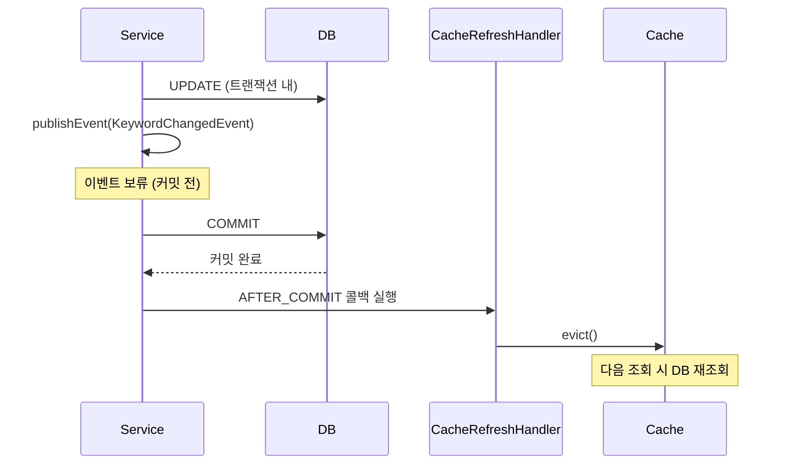

---
tags:
  - spring
  - cache
  - caffeine
  - performance
  - backend
category: resource
created: 2026-03-26
related:
  - spring-cache-aop-proxy-pattern
  - spring-aop-proxy-self-invocation
  - spring-transactional-deep-dive
---

# 🔍 Spring Cache 추상화와 Caffeine 전략

> @Cacheable/@CacheEvict 동작 원리, Caffeine vs Redis 트레이드오프, Cache Invalidation 타이밍 설계

---

## 📌 Situation / Symptom

메시지 발송 hot path에서 매 요청마다 DB에 금지 키워드 목록을 조회하고 있었다. 단순한 `Set` 포함 여부 확인인데 네트워크 I/O가 발생하고 있었다.

Redis 캐시를 먼저 적용했는데 새로운 문제가 발생했다: DB 롤백 후에도 Redis에 유령 키워드가 잔존하고, 서버 재시작 후에도 삭제된 키워드가 남아있는 현상. Redis는 별도 프로세스이므로 JVM 재시작과 무관하게 상태가 유지되었기 때문이다.

---

## 🔍 Technical Analysis

### 1. 캐시가 필요한 이유 — 속도 차이

| 저장소 | 접근 방식 | 레이턴시 |
|--------|----------|---------|
| MySQL (DB) | 디스크 I/O + 쿼리 파싱 + 네트워크 | ~수ms |
| Redis | TCP 소켓 (네트워크 왕복) | ~1ms |
| Caffeine (JVM 힙) | 메모리 직접 접근 | ~100ns |

DB가 **Source of Truth**이고 캐시는 그 복사본이다. 복사본이므로 항상 최신 상태가 아닐 수 있다(Stale Cache). 캐시 설계의 핵심은 **언제 복사본을 버리고 원본을 다시 읽을 것인가**를 결정하는 것이다.

### 2. Spring Cache 추상화 — @Cacheable과 @CacheEvict

Spring Cache는 캐시 구현체(Redis, Caffeine, EhCache 등)와 무관하게 동일한 어노테이션으로 캐시를 제어하는 추상화 계층이다.

**@Cacheable 동작 흐름:**

```
첫 번째 호출:
호출 → 캐시 조회 → 미스 → 메서드 실행 → 결과를 캐시에 저장 → 반환

이후 호출:
호출 → 캐시 조회 → 히트 → 즉시 반환 (메서드 미실행)
```

```java
@Cacheable(value = "keywords", key = "'all'")
public Set<String> loadAll() {
    return keywordMapper.findAll();  // 캐시 미스 시에만 실행
}
```

**@CacheEvict 동작:**

```java
@CacheEvict(value = "keywords", allEntries = true)
public void evict() {
    // 로직 없음. 어노테이션만으로 캐시 무효화
}
```

`allEntries = true`: 해당 캐시 이름의 모든 엔트리를 제거. 다음 `@Cacheable` 호출 시 DB를 재조회한다.

> [!tip] Best Practice
> `@Cacheable`과 `@CacheEvict`는 같은 클래스에 두되, 그 클래스는 어노테이션 처리만 전담해야 한다. self-invocation 문제([[spring-aop-proxy-self-invocation|AOP Self-Invocation 함정]])를 피하기 위해 비즈니스 로직 클래스는 이 캐시 전담 Bean을 외부에서 주입받아 사용한다.

### 3. Redis vs Caffeine 트레이드오프

| 항목 | Redis | Caffeine (JVM 로컬) |
|------|-------|---------------------|
| **접근 방식** | TCP 소켓 (네트워크) | JVM 힙 메모리 |
| **레이턴시** | ~1ms (왕복) | ~100ns |
| **멀티 인스턴스 일관성** | 모든 인스턴스 공유 | 인스턴스 간 불일치 가능 |
| **재시작 시 캐시 상태** | 유지 (DB와 불일치 가능) | 자동 초기화 (항상 DB 기준) |
| **롤백 시 캐시 일관성** | 별도 관리 필요 | AFTER_COMMIT 리스너로 제어 가능 |
| **적합한 상황** | 세션, 분산 환경, 공유 상태 | hot path, 읽기 전용, 단일 인스턴스 |

**Caffeine이 유리한 조건:**
- JVM 단위로 캐시가 완결될 때 (인스턴스 간 공유 불필요)
- 레이턴시가 극히 중요한 hot path
- 변경 빈도가 낮고 명시적 무효화가 가능한 데이터
- JVM 재시작 시 자동 초기화가 오히려 장점인 경우 (DB와 항상 일치 보장)

### 4. Cache Invalidation 전략 — AFTER_COMMIT의 중요성

캐시 무효화 타이밍이 잘못되면 데이터 불일치가 발생한다.

**잘못된 방식 (@EventListener — 트랜잭션 내부에서 evict):**

```
트랜잭션 시작
  → DB UPDATE
  → 이벤트 발행
  → @EventListener: evict() 실행 ← 아직 커밋 전
  → 다른 스레드: loadAll() → DB 조회 (커밋 전 상태 or 롤백 예정 데이터)
  → 다른 스레드: 캐시에 저장
  → 롤백 발생 → DB는 원래 상태
  → 캐시에는 롤백된 데이터 잔존 ← Stale Cache 오염
```

**올바른 방식 (@TransactionalEventListener AFTER_COMMIT):**



```java
@TransactionalEventListener(phase = TransactionPhase.AFTER_COMMIT)
public void onKeywordChanged(KeywordChangedEvent event) {
    cacheRepository.evict();
    // 커밋 확정 후에만 실행 → 롤백 시 미실행 → 캐시 오염 없음
}
```

| 리스너 | 실행 시점 | 롤백 시 |
|--------|----------|--------|
| `@EventListener` | 이벤트 발행 즉시 (트랜잭션 내) | 실행됨 → 캐시 오염 가능 |
| `@TransactionalEventListener(AFTER_COMMIT)` | 커밋 완료 후 | 미실행 → 캐시 보존 |

### 5. TTL 없는 수동 무효화 전용 설계

금지 키워드처럼 **즉시 반영이 중요하고 변경 빈도가 낮은** 데이터에는 TTL을 두지 않는다.

**TTL 설정 시 위험:**
```
TTL 만료 → 캐시 비워짐
    → 재적재 전 요청 유입
    → 캐시 미스 → 금지 키워드 필터 잠시 동작 안 함
    → 정책 위반 메시지 발송 가능
```

TTL은 "오래된 캐시를 자동으로 버린다"는 안전망이지만, 이 경우에는 오히려 취약점이 된다. `AFTER_COMMIT` + `@CacheEvict` 조합으로 정확한 시점에 무효화할 수 있으므로 TTL은 불필요하다.

### 6. Cache Warm-Up — ApplicationRunner

서버 기동 직후 첫 요청 전에 캐시를 채워두는 패턴. 기동 직후 Cache Miss로 인한 DB 부하와 응답 지연을 없앤다.

```java
@Component
public class KeywordCacheWarmUp implements ApplicationRunner {

    private final KeywordCacheRepository cacheRepository;

    @Override
    public void run(ApplicationArguments args) {
        try {
            Set<String> keywords = cacheRepository.loadAll();
            log.info("캐시 워밍업 완료 — {}개", keywords.size());
        } catch (Exception e) {
            log.error("캐시 워밍업 실패 — 앱 기동 중단", e);
            throw e;  // Fail-Fast: 필터 없는 서버 운영 방지
        }
    }
}
```

`ApplicationRunner`를 쓰는 이유: `@PostConstruct`는 Bean 초기화 단계(트랜잭션 컨텍스트 미보장)에서 실행되지만, `ApplicationRunner`는 `ApplicationContext` refresh 완료 후 실행되어 DB 접근이 안전하다. 자세한 내용: [[spring-bean-lifecycle-ioc-di|Spring IoC/DI와 Bean 생명주기]].

### 7. 단일 인스턴스 vs 멀티 인스턴스

Caffeine은 JVM 로컬 캐시이므로 **인스턴스가 2개 이상일 때** 한 인스턴스에서 키워드를 변경해도 다른 인스턴스의 캐시는 즉시 갱신되지 않는다.

```
인스턴스 A: 키워드 추가 → AFTER_COMMIT → evict → 다음 조회 시 최신 데이터
인스턴스 B: 여전히 이전 캐시 유지 (evict 신호 못 받음)
```

**확장 방안**: Redis Pub/Sub으로 evict 신호를 브로드캐스트.
```
인스턴스 A: 캐시 evict + Redis Publish("cache-evict", "keywords")
인스턴스 B, C: Redis Subscribe → 수신 시 로컬 캐시 evict
```

> [!warning] 멀티 인스턴스 주의
> 현재 단일 인스턴스 배포 환경이라도 향후 스케일아웃을 고려하면 이 제약을 설계 문서에 명시해야 한다. Caffeine 선택 시 단일 인스턴스 전제가 내포되어 있다.

---

## 🛠 Solution

**최종 구조:**

```
ContentFilterService
  └─ ContentFilterKeywordStore (비교 로직)
       └─ KeywordCacheRepository (@Cacheable/@CacheEvict 전담)
            └─ KeywordMapper (DB 조회)

KeywordCacheRefreshHandler (@TransactionalEventListener AFTER_COMMIT)
  └─ KeywordCacheRepository.evict()

KeywordCacheWarmUp (ApplicationRunner)
  └─ KeywordCacheRepository.loadAll()  // 기동 시 캐시 사전 적재
```

- Redis 전환으로 네트워크 I/O 제거
- JVM 재시작 = 캐시 자동 초기화 = 구조적으로 DB 불일치 없음
- AFTER_COMMIT으로 롤백 시 캐시 오염 없음

---

## 🔗 Related Concepts

- [[spring-cache-aop-proxy-pattern|Spring Cache AOP 프록시 패턴과 로컬 캐시 전략]] — 같은 주제의 구현 상세 버전 (실제 코드와 Redis SADD 버그 분석 포함)
- [[spring-aop-proxy-self-invocation|Spring AOP 프록시와 Self-Invocation 함정]] — @Cacheable이 silent failure하는 원인
- [[spring-transactional-deep-dive|Spring @Transactional 심층 분석]] — AFTER_COMMIT과 트랜잭션 전파 전략
- [[spring-bean-lifecycle-ioc-di|Spring IoC/DI와 Bean 생명주기]] — ApplicationRunner vs @PostConstruct 선택 기준

---

## 📚 References

- [Spring Cache Abstraction 공식 문서](https://docs.spring.io/spring-framework/reference/integration/cache.html)
- [Caffeine Cache GitHub](https://github.com/ben-manes/caffeine)
- [Spring @TransactionalEventListener 공식 문서](https://docs.spring.io/spring-framework/docs/current/javadoc-api/org/springframework/transaction/event/TransactionalEventListener.html)
