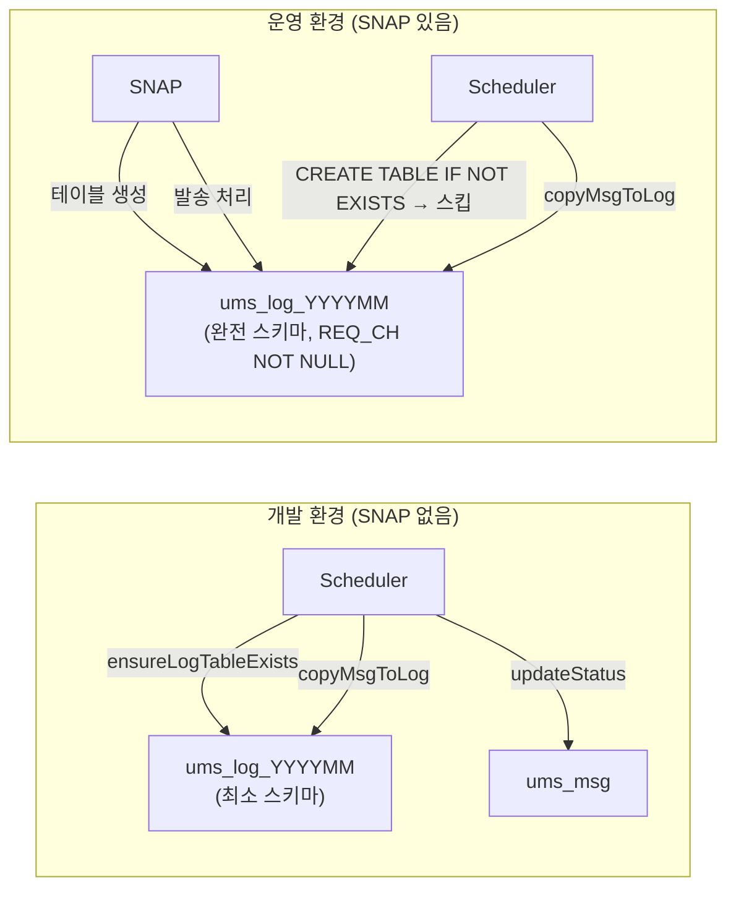

---
tags:
  - backend
  - spring
  - scheduler
  - testing
  - design-pattern
category: resource
created: 2026-04-20
related:
  - spring-batch-scheduler-chunk-delete
  - spring-event-cqrs-sync-pattern
---

# 🔍 개발환경 외부 모듈 시뮬레이터 패턴

> 외부 시스템(SNAP, MQ, 결제 모듈 등)이 없는 개발/테스트 환경에서 해당 시스템의 역할을 대신하는 스케줄러 기반 시뮬레이터 구현 패턴

---

## 📌 Situation / Symptom

외부 모듈이 특정 테이블에 데이터를 쓰거나 상태를 변경하는 역할을 담당할 때, 개발 환경에는 해당 모듈이 없다. 이 상황에서 두 가지 문제가 발생한다.

1. 외부 모듈이 생성하는 테이블 스키마와 애플리케이션이 가정하는 스키마가 다를 수 있음
2. 외부 모듈의 동작을 흉내 내는 코드가 실제 모듈 환경과 미묘하게 달라 **스키마 불일치 버그**가 숨겨짐

**실제 발생한 에러 예시:**

```
DataIntegrityViolationException: Field 'REQ_CH' doesn't have a default value
```

- 시뮬레이터가 fallback으로 생성한 테이블: 최소 컬럼(`CLIENT_KEY`)만 포함
- 실제 외부 모듈(SNAP)이 생성한 테이블: `REQ_CH NOT NULL` 등 추가 제약 포함
- 결과: `INSERT INTO log_table (CLIENT_KEY) SELECT CLIENT_KEY FROM ...` 쿼리가 NOT NULL 컬럼 누락으로 실패

---

## 🔍 Technical Analysis

### 구조 이해: 두 가지 실행 환경



### 핵심 원인: 환경별 스키마 분기

| 항목 | 개발환경 (fallback) | 운영환경 (SNAP 생성) |
|------|--------------------|--------------------|
| 테이블 생성 주체 | `ensureLogTableExists` | SNAP 외부 모듈 |
| 스키마 범위 | 최소 컬럼만 | 전체 컬럼 + NOT NULL 제약 |
| `CREATE TABLE IF NOT EXISTS` | 실행됨 | 스킵됨 (이미 존재) |
| 쿼리 실패 가능성 | 없음 | 컬럼 불일치 시 실패 ⚠️ |

### 왜 이 버그가 숨겨지는가?

1. 개발 환경에서는 fallback 스키마와 쿼리가 정확히 맞아떨어지기 때문에 문제가 없음
2. 운영/스테이징 환경에서 SNAP이 있을 때 처음으로 스키마 불일치가 드러남
3. `CREATE TABLE IF NOT EXISTS`가 조용히 스킵되기 때문에 테이블은 생성되지만 스키마가 다름

> [!tip] Best Practice
> 외부 모듈이 생성하는 테이블에 INSERT할 때는 **컬럼 명시 방식(`INSERT INTO t (col1, col2)`)보다 `INSERT INTO t SELECT * FROM`** 방식을 사용하면 스키마 변화에 유연하게 대응할 수 있다. 단, SELECT * 는 컬럼 순서에 의존하므로 스키마가 안정적인 경우에만 적용한다.

---

## 🛠 Solution

### 근본 원인

시뮬레이터의 `copyMsgToLog` 쿼리가 특정 컬럼만 명시적으로 복사했기 때문에, 실제 외부 모듈이 생성한 테이블의 NOT NULL 컬럼들이 누락됨.

### 수정 방법

```xml
<!-- Before: 컬럼 명시 방식 (스키마 불일치에 취약) -->
<insert id="copyMsgToLog">
    INSERT INTO ${logTable} (CLIENT_KEY)
    SELECT CLIENT_KEY
    FROM ums_msg
    WHERE MSG_STATUS = 'pre-send'
</insert>

<!-- After: SELECT * 방식 (전체 컬럼 복사) -->
<insert id="copyMsgToLog">
    INSERT INTO ${logTable}
    SELECT *
    FROM ums_msg
    WHERE MSG_STATUS = 'pre-send'
</insert>
```

> [!warning] 주의사항
> `SELECT *` 방식은 `ums_msg`와 `ums_log_YYYYMM`의 **컬럼 수와 순서가 동일**하다는 전제가 필요하다. 두 테이블의 스키마가 다르다면 명시적 컬럼 매핑이 더 안전하다.

### 시뮬레이터 구현 전략

```java
@Scheduled(fixedDelay = 5000)
public void simulateSnap() {
    String logTable = resolveLogTableName(); // ums_log_YYYYMM
    
    // 1. SNAP이 없는 경우 fallback: 테이블이 없으면 생성
    ensureLogTableExists(logTable);
    
    // 2. SNAP 역할: ums_msg → ums_log 복사
    copyMsgToLog(logTable);
    
    // 3. 상태 업데이트: pre-send → complete
    updateMsgStatus();
}
```

---

## 🔗 Related Concepts

- [[spring-batch-scheduler-chunk-delete|배치 스케줄러 구현 패턴]] - @Scheduled 기반 청크 처리
- [[spring-event-cqrs-sync-pattern|Spring Event 기반 CQRS 동기화]] - 이벤트 기반 상태 동기화
- [[resource/topics/architecture/cqrs-hybrid-orm-linkwave|CQRS 하이브리드 ORM 전략]] - JPA + MyBatis 역할 분리

---

## 📚 References

- [MyBatis Dynamic SQL](https://mybatis.org/mybatis-3/dynamic-sql.html)
- [Spring @Scheduled](https://docs.spring.io/spring-framework/docs/current/javadoc-api/org/springframework/scheduling/annotation/Scheduled.html)
