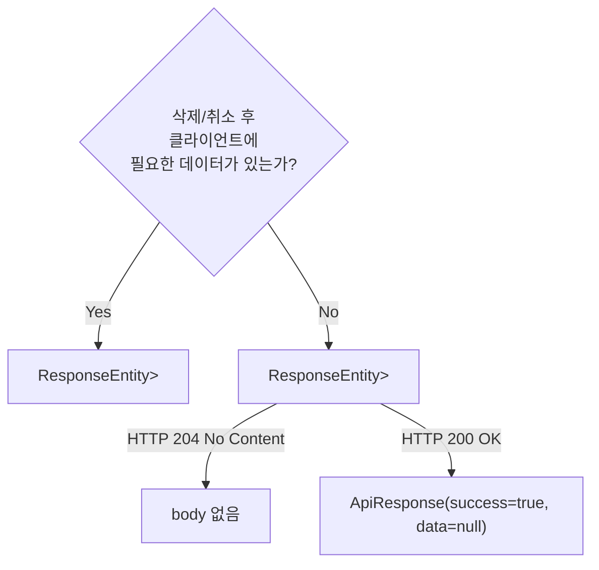

---
tags:
  - backend
  - spring
  - rest-api
  - design-pattern
  - http
category: resource
created: 2026-04-20
related:
  - spring-rfc9457-error-handling
  - spring-cqrs-command-query-path-separation
  - spring-dto-naming-conventions
---

# 🔍 REST DELETE API 설계 원칙

> Spring MVC에서 DELETE 엔드포인트를 설계할 때의 PathVariable vs RequestBody 선택 기준, 반환 타입 결정, @Valid 적용 범위

---

## 📌 Situation / Symptom

취소·삭제 기능의 컨트롤러를 구현할 때 반복적으로 등장하는 설계 결정:

1. 리소스 식별자를 PathVariable로 받아야 하는가, RequestBody로 받아야 하는가?
2. 삭제/취소 후 반환 타입은 무엇인가? (`Void`? `Boolean`? 삭제된 객체?)
3. String 타입 PathVariable에 `@Valid`를 붙여야 하는가?

---

## 🔍 Technical Analysis

### URL 설계: PathVariable vs RequestBody

REST의 핵심 원칙은 **URL이 리소스를 식별**한다는 것이다.

| 경우 | 권장 방식 | 이유 |
|------|-----------|------|
| 리소스 식별자 (ID, key) | PathVariable | URL 자체가 리소스를 특정함 |
| 추가 필터 조건 | RequestParam | 조회/필터링 의미 |
| 삭제 사유, 부가 정보 | RequestBody | HTTP 스펙상 가능하지만 비표준적 |
| 없음 (단순 취소) | PathVariable만 | Body 불필요 |

```java
// 권장: 리소스 식별자를 URL에 포함
DELETE /api/v1/messages/{clientKey}/schedule

// 비권장: 식별자를 Body에 포함
DELETE /api/v1/messages/schedule
Body: { "clientKey": "abc123" }
```

**왜 PathVariable이 맞는가?**
- `/messages/{clientKey}/schedule`는 "clientKey를 가진 메시지의 예약" 이라는 **리소스를 직접 지칭**함
- URL만으로 어떤 리소스에 대한 작업인지 명확히 전달됨
- 로깅, 캐시 무효화, 인증/인가 정책 적용이 URL 기반으로 단순화됨

### 반환 타입 결정



취소/삭제는 일반적으로 **결과 데이터가 없으므로** `Void` 제네릭 타입이 적합하다.

```java
// 취소 엔드포인트 예시
@DeleteMapping("/{clientKey}/schedule")
public ResponseEntity<ApiResponse<Void>> cancelScheduledMessage(
        @PathVariable String clientKey) {
    cancelService.cancelScheduledMessage(clientKey);
    return ResponseEntity.ok(ApiResponse.success(null));
}
```

> [!tip] Best Practice
> 취소/삭제 후 **204 No Content**를 반환할지, **200 OK + `{success: true}`**를 반환할지는 팀 컨벤션을 따른다. 200을 사용할 경우 `ApiResponse<Void>`에서 `data` 필드는 `null`이 된다. 일관성이 가장 중요하다.

### @Valid 적용 범위

`@Valid`는 **Bean Validation 어노테이션(`@NotNull`, `@Size` 등)이 선언된 객체**에 대해서만 동작한다.

| 대상 | @Valid 필요 여부 | 이유 |
|------|----------------|------|
| `@RequestBody` DTO | 필요 | DTO 내부 필드에 Bean Validation 적용 |
| `@PathVariable String` | 불필요 | String은 Bean Validation 대상 아님 |
| `@RequestParam` | 불필요 (단순 타입) | 직접 타입 변환으로 처리 |
| `@PathVariable` + `@NotNull` | 가능하지만 비권장 | URL 존재 자체가 not-null 보장 |

```java
// String PathVariable에 @Valid는 무의미
@DeleteMapping("/{clientKey}/schedule")
public ResponseEntity<?> cancel(
        @Valid @PathVariable String clientKey) { // @Valid 불필요
    ...
}

// 올바른 사용: DTO에 적용
@PostMapping
public ResponseEntity<?> create(
        @Valid @RequestBody CreateMessageRequest request) { // 유효
    ...
}
```

---

## 🛠 Solution

### 예약 메시지 취소 엔드포인트 구현 패턴

```java
// MessageController.java (Command 측)
@RestController
@RequestMapping("/api/v1/messages")
@RequiredArgsConstructor
public class MessageController {

    private final MessageService messageService;

    // 예약 취소: 리소스 식별자는 PathVariable, 반환 데이터 없음
    @DeleteMapping("/{clientKey}/schedule")
    public ResponseEntity<ApiResponse<Void>> cancelScheduledMessage(
            @PathVariable String clientKey) {
        messageService.cancelScheduledMessage(clientKey);
        return ResponseEntity.ok(ApiResponse.success(null));
    }
}
```

> [!warning] 서비스 레이어 확인
> 컨트롤러 누락 패턴: 서비스 메서드는 이미 구현되어 있지만 컨트롤러에 엔드포인트가 추가되지 않은 경우가 종종 있다. 새 기능 구현 전 서비스 레이어를 먼저 확인하면 중복 구현을 방지할 수 있다.

---

## 🔗 Related Concepts

- [[spring-rfc9457-error-handling|RFC 9457 에러 처리]] - API 에러 응답 표준화
- [[spring-cqrs-command-query-path-separation|CQRS Command/Query 경로 분리]] - 컨트롤러 레벨 분리 전략
- [[spring-dto-naming-conventions|DTO 네이밍 컨벤션]] - Request/Response suffix 규칙

---

## 📚 References

- [RFC 7231 - HTTP DELETE](https://datatracker.ietf.org/doc/html/rfc7231#section-4.3.5)
- [Spring MVC @PathVariable](https://docs.spring.io/spring-framework/docs/current/reference/html/web.html#mvc-ann-requestmapping-uri-templates)
- [Bean Validation 2.0](https://beanvalidation.org/2.0/)
