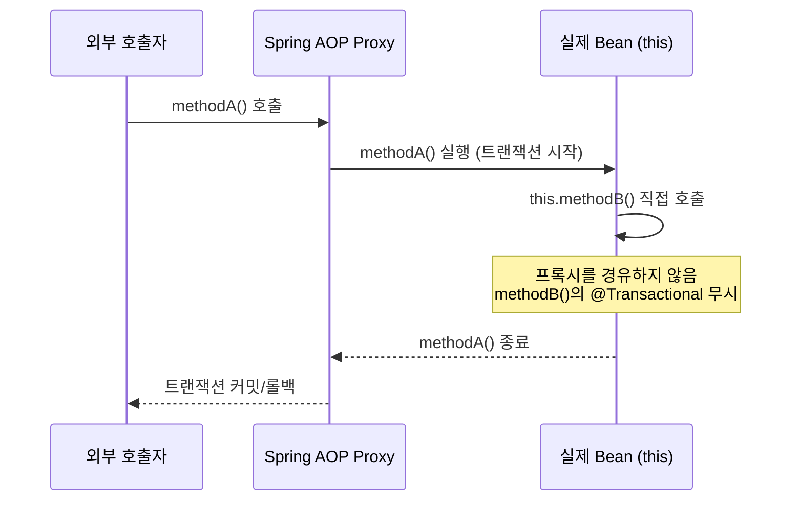
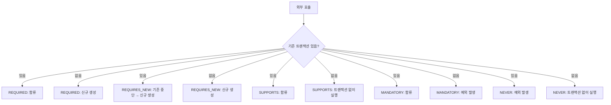

---
tags:
  - spring
  - transaction
  - transactional
  - aop
  - propagation
  - backend
category: resource
created: 2026-03-23
related:
  - spring-transaction-distributed-lock-redis
  - spring-event-design-domain-vs-infra
  - spring-internals-bean-lifecycle-event
---

# 🔍 Spring @Transactional 심층 분석

> 클래스/메서드 레벨 우선순위, self-invocation 함정, Propagation 7가지 전략과 실무 선택 기준

---

## 📌 Situation / Symptom

**상황 1 — 클래스 레벨 @Transactional이 예상과 다르게 동작**

서비스 클래스 전체에 `@Transactional(readOnly = true)`를 선언했는데, 특정 쓰기 메서드에서 flush가 안 되는 현상. 메서드 레벨에 `@Transactional`을 추가했더니 해결됨.

**상황 2 — 내부 메서드의 @Transactional(REQUIRES_NEW)가 무시됨**

같은 클래스의 `A()`에서 `B()`를 호출했을 때 `B()`의 `@Transactional(propagation = REQUIRES_NEW)`가 동작하지 않아 독립 트랜잭션으로 분리되지 않음.

**상황 3 — @Async 핸들러 내 REQUIRES_NEW가 필요한 이유**

`ContentViolationEventHandler`가 `@Async @EventListener`로 분리됐는데, 이 안에서도 `@Transactional`이 필요한지, 어떤 propagation을 써야 하는지 혼란.

---

## 🔍 Technical Analysis

### 1. 클래스 레벨 vs 메서드 레벨 우선순위

Spring은 `@Transactional`을 두 곳에 선언할 수 있으며 **메서드 레벨이 클래스 레벨을 덮어씀**.

```java
// 추상화된 예시
@Transactional(readOnly = true)  // 클래스 레벨: 기본값
public class ExampleService {

    public List<Item> findAll() { ... }  // readOnly = true 상속

    @Transactional  // 메서드 레벨: readOnly = false로 덮어씀
    public void create(Item item) { ... }
}
```

| 적용 위치 | 효과 |
|-----------|------|
| 클래스 레벨 | 모든 `public` 메서드에 기본값 적용 |
| 메서드 레벨 | 해당 메서드에만 적용, 클래스 레벨 완전히 대체 |
| `private` 메서드 | AOP 프록시가 가로채지 못하므로 **무효** |

> [!tip] Best Practice
> 클래스 레벨에 `@Transactional(readOnly = true)`를 선언하고, 쓰기 메서드에만 `@Transactional`을 개별 선언하는 패턴이 JPA 성능 최적화(스냅샷 미생성)에 유리하다.

### 2. Self-invocation 문제 — AOP 프록시의 근본 한계

Spring `@Transactional`은 **AOP 프록시**를 통해 동작한다. 같은 클래스 내부에서 메서드를 호출하면 프록시를 우회하고 실제 객체가 직접 호출된다.



이 특성은 `@Transactional`뿐 아니라 `@Async`, `@Cacheable`, `@Retry` 등 **Spring AOP 기반 모든 어노테이션에 동일하게 적용**된다.

**우회 방법 (우선순위 순):**

1. **빈 분리**: `B()`를 다른 서비스 빈으로 추출 (가장 권장)
2. **ApplicationContext**: `context.getBean(MyService.class).methodB()` (테스트용)
3. **AopContext**: `((MyService) AopContext.currentProxy()).methodB()` (비권장, exposeProxy = true 필요)

### 3. Propagation 전략 7가지



| Propagation | 기존 있음 | 기존 없음 | 주요 사용처 |
|-------------|-----------|-----------|------------|
| `REQUIRED` (기본) | 합류 | 신규 생성 | 일반 서비스 메서드 |
| `REQUIRES_NEW` | 기존 중단 → 신규 | 신규 생성 | 감사 로그, 독립 저장 |
| `SUPPORTS` | 합류 | 없이 실행 | 읽기 전용 유틸리티 |
| `NOT_SUPPORTED` | 기존 중단 | 없이 실행 | 장시간 비트랜잭션 배치 |
| `MANDATORY` | 합류 | 예외 | "단독 호출 금지" 강제 |
| `NEVER` | 예외 | 없이 실행 | 트랜잭션 금지 구간 |
| `NESTED` | savepoint 중첩 | 신규 생성 | 부분 롤백 허용 배치 |

> [!tip] Best Practice
> 실무에서 실질적으로 쓰는 propagation은 `REQUIRED`(기본)와 `REQUIRES_NEW` 두 가지가 대부분이다. 나머지는 특수 상황에서 선택한다.

---

## 🛠 Solution

### REQUIRES_NEW 실무 적용 — 감사 로그 독립 저장

**문제**: 메시지 발송 트랜잭션이 롤백되더라도 위반 감사 로그는 저장되어야 함.

**해결**: `@Async` + `@EventListener`로 완전히 분리 → 별도 스레드에서 새 트랜잭션 시작.

```java
// 추상화된 예시 — 핵심 패턴만
@Component
public class AuditEventHandler {

    @Async
    @EventListener
    @Transactional  // 별도 스레드이므로 항상 새 트랜잭션 (REQUIRED로 충분)
    public void handle(AuditEvent event) {
        auditRepository.save(event.toEntity());
    }
}
```

**왜 @Async를 썼는가**: `checkContent()`가 예외를 던지는 시점에 이벤트를 발행하고 트랜잭션이 롤백됨. `@TransactionalEventListener(AFTER_COMMIT)`은 커밋 후에만 핸들러를 실행하므로 롤백 시 핸들러 자체가 실행되지 않음. 따라서 `@EventListener`(발행 즉시 실행) + `@Async`(별도 스레드 → 별도 트랜잭션) 조합 선택.

> [!warning] REQUIRES_NEW 커넥션 고갈 주의
> `REQUIRES_NEW`는 외부 트랜잭션 커넥션을 중단(suspend)하고 새 커넥션을 획득한다. 동시에 두 커넥션을 점유하므로, **DB 커넥션 풀이 작을 때 데드락** 위험이 있다. 고빈도 경로에서는 `@Async`로 스레드와 커넥션을 분리하는 패턴을 우선 검토할 것.

### Self-invocation 해결 — 빈 분리 패턴

```java
// Before: 내부 호출로 @Transactional(REQUIRES_NEW) 무시됨
@Service
public class OrderService {
    public void placeOrder(Order order) {
        process(order);
        this.saveAudit(order); // self-invocation — REQUIRES_NEW 무시
    }

    @Transactional(propagation = Propagation.REQUIRES_NEW)
    public void saveAudit(Order order) { ... }
}

// After: 빈 분리로 해결
@Service
public class OrderService {
    private final AuditService auditService;

    public void placeOrder(Order order) {
        process(order);
        auditService.saveAudit(order); // 프록시 경유 → REQUIRES_NEW 정상 동작
    }
}

@Service
public class AuditService {
    @Transactional(propagation = Propagation.REQUIRES_NEW)
    public void saveAudit(Order order) { ... }
}
```

---

## 🔗 Related Concepts

- [[resource/topics/spring/spring-transaction-distributed-lock-redis|Spring 트랜잭션과 분산 락: Redis 전략]] — JpaTransactionManager @Primary 설정, 다중 서버 배치 환경
- [[resource/topics/spring/spring-event-design-domain-vs-infra|Spring 이벤트 설계: 도메인 이벤트 vs 인프라 이벤트]] — @TransactionalEventListener propagation 제약, @Async 감사 로그 패턴
- [[resource/topics/spring/spring-internals-bean-lifecycle-event|Spring Bean 라이프사이클과 이벤트]] — AOP 프록시 생성 과정, @Async 동작 원리

---

## 📚 References

- [Spring Docs — Transaction Management](https://docs.spring.io/spring-framework/docs/current/reference/html/data-access.html#transaction)
- [Spring Docs — @Transactional Propagation](https://docs.spring.io/spring-framework/docs/current/javadoc-api/org/springframework/transaction/annotation/Propagation.html)
- [Spring Docs — Understanding AOP Proxies](https://docs.spring.io/spring-framework/docs/current/reference/html/core.html#aop-understanding-aop-proxies)
