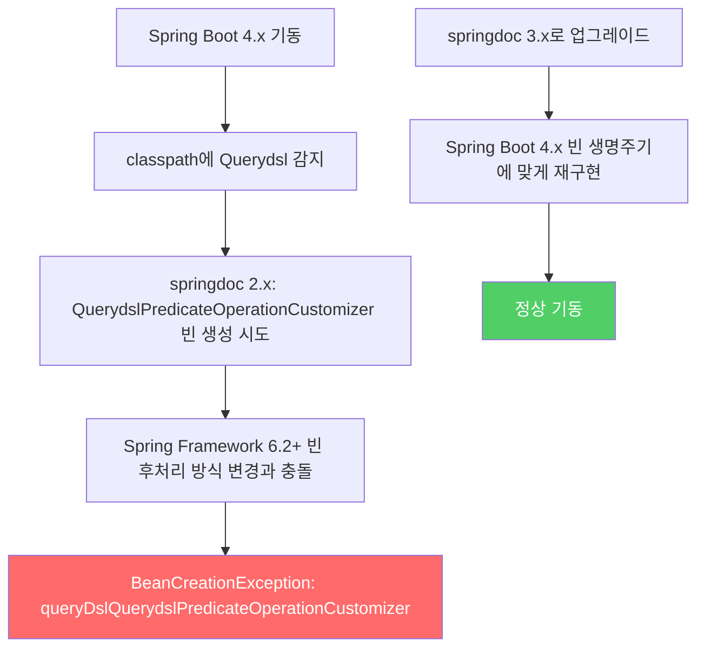

# 🔍 springdoc-openapi + Swagger UI 설정 가이드

## 📌 Situation / Symptom

Spring Boot 프로젝트에 API 문서화가 필요할 때 수동 마크다운 명세는 유지 비용이 높다.
컨트롤러 어노테이션 기반으로 OpenAPI 스펙을 자동 생성하고, Swagger UI로 인터랙티브한 API 테스트 환경을 제공하려면 springdoc-openapi를 사용한다.

Spring Boot 4.x + Querydsl 조합에서 다음 에러가 발생할 수 있다:

```
Error creating bean with name 'queryDslQuerydslPredicateOperationCustomizer'
```

---

## 🔍 Technical Analysis

### springdoc vs Swagger UI 역할 분리

| 컴포넌트 | 역할 | 엔드포인트 |
|---------|------|-----------|
| **springdoc-openapi** | 컨트롤러를 리플렉션으로 분석해 OpenAPI 3.x JSON 스펙 자동 생성 | `/api-docs` |
| **Swagger UI** | OpenAPI JSON을 시각화 + 브라우저에서 API 직접 테스트 | `/swagger-ui.html` |

두 역할은 `springdoc-openapi-starter-webmvc-ui` artifact 하나로 함께 제공된다.
분리해서 사용하는 경우는 드물고, 통상 이 starter 하나로 모두 해결한다.

### Spring Boot 버전별 springdoc 버전 매핑

| Spring Boot | springdoc | 비고 |
|------------|----------|------|
| 2.x | 1.x | `springdoc-openapi-ui` |
| 3.x | 2.x | `springdoc-openapi-starter-webmvc-ui` |
| 4.x | 3.x | Spring Framework 6.2+ 대응 |

> [!tip] Best Practice
> Spring Boot 4.x 프로젝트는 반드시 springdoc 3.x를 사용할 것.
> 버전 매핑 미스매치가 `BeanCreationException`의 가장 흔한 원인이다.

### BeanCreationException 발생 메커니즘



springdoc 2.8.6은 classpath에 Querydsl이 있으면 자동으로 `QuerydslPredicateOperationCustomizer` 빈을 등록한다.
그런데 Spring Boot 4.0 (Spring Framework 6.2+)에서 빈 정의 후처리(post-processing) 방식이 변경되면서 이 자동 등록 로직과 충돌한다.

---

## 🛠 Solution

### 의존성 설정

```gradle
// build.gradle — Spring Boot 4.x 기준
implementation 'org.springdoc:springdoc-openapi-starter-webmvc-ui:3.0.2'
```

### OpenAPI 빈 설정

```java
@Configuration
public class SwaggerConfig {

    @Bean
    public OpenAPI openAPI() {
        return new OpenAPI()
            .info(new Info()
                .title("API Docs")
                .description("API 명세")
                .version("v1.0"))
            .addSecurityItem(new SecurityRequirement().addList("bearerAuth"))
            .components(new Components()
                .addSecuritySchemes("bearerAuth",
                    new SecurityScheme()
                        .type(SecurityScheme.Type.HTTP)
                        .scheme("bearer")
                        .bearerFormat("JWT")));
    }
}
```

### SecurityConfig — Swagger 경로 허용

```java
// SecurityConfig.java
http.authorizeHttpRequests(auth -> auth
    .requestMatchers(
        "/swagger-ui/**",
        "/swagger-ui.html",
        "/api-docs/**"
    ).permitAll()
    // ... 나머지 규칙
);
```

### 컨트롤러 어노테이션 패턴

```java
@Tag(name = "Users", description = "사용자 관련 API")
@RestController
@RequestMapping("/api/v1/users")
public class UserController {

    @Operation(summary = "사용자 조회", description = "ID로 사용자를 조회한다")
    @GetMapping("/{id}")
    public ResponseEntity<UserResponse> getUser(@PathVariable Long id) {
        // ...
    }
}
```

> [!warning] 주의사항
> `application.yml`에서 `springdoc.api-docs.path`, `springdoc.swagger-ui.path`를 커스텀할 수 있다.
> 변경했다면 SecurityConfig의 `permitAll()` 경로도 함께 맞춰야 한다.
> 기본값: `/api-docs`, `/swagger-ui.html`

---

## 🔗 Related Concepts

- [[resource/topics/spring/spring-internals-bean-lifecycle-event|Spring Bean 라이프사이클과 빈 등록]] — BeanCreationException 이해에 필요한 빈 생명주기 배경
- [[resource/topics/spring/spring-rfc9457-error-handling|RFC 9457 에러 처리]] — Swagger에 에러 응답 스펙을 명세하는 방법과 연계
- [[resource/topics/spring/spring-boot-best-practices|Spring Boot 실무 패턴]] — 설정 클래스 분리 패턴

---

## 📚 References

- [springdoc-openapi 공식 문서](https://springdoc.org/)
- [springdoc 3.x Migration Guide](https://springdoc.org/migrating-from-springdoc-v2.html)
- [OpenAPI 3.x Specification](https://spec.openapis.org/oas/v3.1.0)
